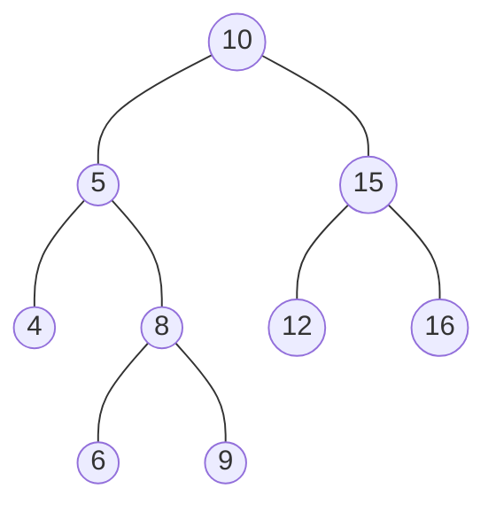
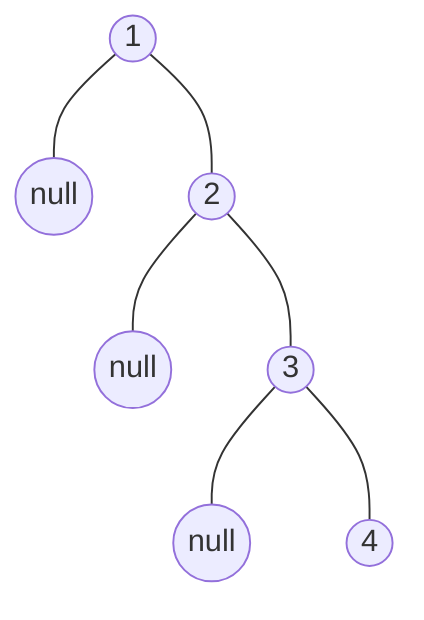

這週是六角鼠年鐵人賽第二十二週，接下來我們回到樹狀資料結，之前我們還沒實作過，這邊將使用二元搜尋樹來實作。

<!--more-->



## 二元搜尋樹

**二元搜尋樹（Binary Search Tree）**，也稱為 **有序二元樹（Ordered binary tree）** 或 **排序二元樹（Sorted binary tree）**，是一種具有特殊性值的二元樹。

具有以下特點：
1. 若任意節點的左子樹不空，則左子樹上所有節點的值均小於它的根節點的值；
2. 若任意節點的右子樹不空，則右子樹上所有節點的值均大於或等於它的根節點的值；
3. 任意節點的左、右子樹也分別為二元搜尋樹；

簡單來說，只允許在左側存放比父節點小的值，在右側存放比父節點大於等於的值。

那麼為什麼又稱作 **排序二元樹** 呢？因為當它使用中序走訪所有節點時，會依照大小遞增訪問節點。

## 使用 JavaScript 實作二元搜尋樹

### 1. 基本結構

節點：
```javascript
class Node {
  constructor(data, left = null, right = null) {
    this.data = data;
    this.left = left;
    this.right = right;
  }
}
```
- 每個節點都有一個值
- 每個節點一個左節點
- 每個節點一個右節點

根：
```javascript
class BinarySearchTree {
  constructor() {
    this.root = null;
  }
  
  // methods
  insert(data) {}
  preOrderTraverse() {}
  inOrderTraverse() {}
  postOrderTraverse() {}
  levelorderTraversal() {}
  findMin() {}
  findMax() {}
  search(data) {}
  remove(data) {}
}
```

方法：
- `insert(data)`：新增節點，並回傳更新後的樹。
- 走訪所有節點：
  - `preOrderTraverse()` 前序走訪
  - `inOrderTraverse()` 中序走訪
  - `postOrderTraverse()` 後序走訪
  - `levelorderTraversal()` 層序走訪
- `findMin()`：回傳樹中最小值節點。
- `findMax()`：回傳樹中最大值節點。
- `search(data)`：搜尋特定節點並回傳該節點，不存在則回傳 `null`。
- `remove(data)`：刪除特定節點並回傳更新後的樹，不存在則回傳 `null`。

### 2. 新增節點

向樹新增一個節點，主要會判斷根節點是否為空，如果是空的就將節點設為根節點，反之加到其他位置。

二元搜尋樹的特性，若任意節點的不為空
- 小於放入左節點；
- 大於等於放入右節點。

#### 2.1 遞迴

```javascript
insert(data) {
  const newNode = new Node(data);    // 1
  this.root ? insertHelper(this.root) : (this.root = newNode); // 2
  return this.root;
  
  // 3
  function insertHelper(node) {
    if (data < node.data) {
      node.left ? insertHelper(node.left) : (node.left = newNode);
    } else {
      node.right ? insertHelper(node.right) : (node.right = newNode);
    }
  }
}
```
1. 建立新節點。
2. 判斷根節點是否為空：
   - 不是 `null`，執行輔助函式；
   - 若是，直接新增節點。
3. 輔助函式：判斷新節點要放左邊還是右邊，新增前一樣要判斷位置是否為空。

或是：
```javascript
insert(data) {
  this.root = insertHelper(this.root);
  return this.root;

  function insertHelper(node) {
    if (!node) {
      return new Node(data);
    } else if (data < node.data) {
      node.left = insertHelper(node.left);
    } else {
      node.right = insertHelper(node.right);
    }
    return node;
  }
}
```


#### 2.2 迭代

使用迭代結構：
```javascript
insert(data) {
  const newNode = new Node(data);
  // 1
  if (!this.root) {
    this.root = newNode;
    return this.root;
  }
  
  let node = this.root;  // 2
  
  // 3
  while (node) {
    if (data < node.data) {
      if (node.left) {
        node = node.left;
      } else {
        node.left = newNode;
        break;
      }
    } else {
      if (node.right) {
        node = node.right;
      } else {
        node.right = newNode;
        break;
      }
    }
  }
  return this.root;
}
```
1. 一樣先判斷根節點是否為空。
2. 使用變數儲存當前節點。
3. 判斷新節點要放左邊還是右邊，新增完後就跳出 `while` 迴圈。

#### 2.3 測試

```javascript
const tree = new BinarySearchTree();

tree.insert(10);
tree.insert(5);
tree.insert(15);
tree.insert(4);
tree.insert(12);
tree.insert(8);
tree.insert(6);
tree.insert(9);
tree.insert(16);
```

二元搜尋樹的結構：


### 3. DFS

DFS 共有三種走訪順序：
- 前序走訪
- 中序走訪
- 後序走訪

#### 3.1 遞迴

首先是前序走訪，執行順序為：
1. （N）訪問當前節點 
2. （L）走訪左子樹 
3. （R）走訪右子樹

遞迴：
```javascript
preOrderTraverse() {
  const temp = [];
  preHelper(this.root);
  return temp;

  function preHelper(node) {
    if (node) {
      temp.push(node.data);
      preHelper(node.left);
      preHelper(node.right);
    }
  }
}
```

中序、後序走訪差異不大：
```javascript
inOrderTraverse() {
  const temp = [];
  inHelper(this.root);
  return temp;
  
  function inHelper(node) {
    if (node) {
      inHelper(node.left);
      temp.push(node.data);
      inHelper(node.right);
    }
  };
}

postOrderTraverse() {
  const temp = [];
  postHelper(this.root);
  return temp;
  
  function postHelper(node) {
    if (node) {
      postHelper(node.left);
      postHelper(node.right);
      temp.push(node.data);
    }
  };
}
```

#### 3.2 迭代

我們可以使用堆疊（stack）來模擬遞迴結構。

前序走訪：
```javascript
preOrderTraverse() {
  const temp = [];
  const stack = [];

  if (this.root) {
    stack.push(this.root);
  }

  while (stack.length) {
    let node = stack.pop();
    temp.push(node.data);
    
    if (node.right) {
      stack.push(node.right);
    }
    
    if (node.left) {
      stack.push(node.left);
    }
  }
  return temp;
}
```
因為堆疊是後進先出，因此要先將右子樹推入堆疊再推入左子樹。

中序走訪：
```javascript
inOrderTraverse() {
  const temp = [];
  const stack = [];
  let node = this.root;
  
  while (node || stack.length) {
    while (node) {
      stack.push(node);
      node = node.left;
    }
    
    node = stack.pop();
    temp.push(node.data);
    
    node = node.right;
  }
  return temp;
}
```
先將左子樹全部加入堆疊中，然後逐個取出。


後序走訪可以將前序作法的右子樹與左子樹的堆入順序交換，即 NLR 變成 NRL，最後輸出時反轉陣列，變成 LRN。
```javascript
postOrderTraverse() {
  const temp = [];
  const stack = [];

  if (this.root) {
    stack.push(this.root);
  }

  while (stack.length) {
    let node = stack.pop();
    temp.push(node.data);
    if (node.left) {
      stack.push(node.left);
    }
    if (node.right) {
      stack.push(node.right);
    }
  }
  return temp.reverse();
}
```

#### 3.3 輸出

這是之前輸入的二元搜尋樹結構：


讓我們觀察輸出：
```javascript
console.log( tree.preOrderTraverse() );
// [ 10, 5, 4, 8, 6, 9, 15, 12, 16 ] 

console.log( tree.inOrderTraverse() );
// [ 4, 5, 6, 8, 9, 10, 12, 15, 16 ]  

console.log( tree.postOrderTraverse() );
// [ 4, 6, 9, 8, 5, 12, 16, 15, 10 ] 
```

二元搜尋樹使用不同順序的走訪，有不同的功能：
- 使用先序走訪，可以結構化輸出。
- 使用中序走訪，可以從小到大輸出，其實就是排序操作。
- 使用後序走訪，可以用於計算有層級關係的所有元素的大小。

### 4. BFS

層序走訪會先訪問離根節點最近的節點，也就是它會由上而下，並在同一個階層，由左至右依序訪問節點。

通常會使用佇列（queue）來實現：
```javascript
levelorderTraversal() {
  const temp = [];
  const queue = [];
  
  if (this.root) {
    queue.push(this.root);
  }
  
  while(queue.length) {
    let node = queue.shift();
    temp.push(node.data);
    if(node.left) {
      queue.push(node.left);
    }
    if(node.right) {
      queue.push(node.right);
    }
  }
  return temp;
}
```

這是之前輸入的二元搜尋樹結構：


層序走訪會依照階層，由左至右依序訪問節點：
```javascript
console.log( tree.levelorderTraversal() );
// [ 10, 5, 15, 4, 8, 12, 16, 6, 9 ] 
```

我們可以稍作修改，用陣列存儲每一層的節點：
```javascript
levelorderTraversal() {
  const temp = [];
  const queue = [];
  
  if (this.root) {
    queue.push(this.root);
  }
  
  while(queue.length) {
    let subTemp = [];
    const len = queue.length;
    
    for(let i = 0; i < len; i++) {
      let node = queue.shift();
      subTemp.push(node.data);
      if(node.left) {
        queue.push(node.left);
      }
      if(node.right) {
        queue.push(node.right);
      }
    }
    
    temp.push(subTemp);
  }
  return temp;
}
```
```javascript
console.log( tree.levelorderTraversal() );
// [ [ 10 ], [ 5, 15 ], [ 4, 8, 12, 16 ], [ 6, 9 ] ] 
```


### 4. 尋找 最小值／最大值 節點 

尋找最小值節點，就是一直往左子樹移動，直到空子樹，回傳最左端節點：
```javascript
findMin(node = this.root) {
  let currentNode = node;
  while (currentNode && currentNode.left ) {
    currentNode = currentNode.left;
  }
  return currentNode;
}
```
`node` 預設從根節點為起點。

尋找最大值節點，反過來就是一直往右子樹移動，直到空子樹，回傳最右端節點：
```javascript
findMax(node = this.root) {
  let currentNode = node;
  while (currentNode && currentNode.right) {
    currentNode = currentNode.right;
  }
  return currentNode;
}
```

### 5. 搜尋節點

搜尋特定節點，跟尋找最大最小值差異不大：
```javascript
search(data) {
  let currentNode = this.root;
  while (currentNode) {
    if (data === currentNode.data) {
      return currentNode;
    }
    if (data < currentNode.data) {
      currentNode = currentNode.left;
    } else {
      currentNode = currentNode.right;
    }
  }
  return false;
}
```

也可以使用遞迴方式，搜尋預設起點為根節點：
```javascript
search(data, node = this.root) {
  if (!node) {
    return null;
  }
  if (data === node.data) {
    return node;
  }
  if (node.data > data) {
    return this.search(data, node.left);
  } else {
    return this.search(data, node.right);
  }
}
```

搜尋特定節點一樣會使用遞迴方式來尋找節點：
1. 首先會檢查節點，如果為 `null`，直接退出，並回傳 `null`；
4. 如果找到相等節點，會退出並回傳該節點；
3. 如果傳入的 `data` 比當前傳入節點的 `data` 小，它會繼續遞迴搜尋左側節點；
4. 反之，搜尋右側節點。

更精簡的寫法：
```javascript
search(data, node = this.root) {
  if (!node || data === node.data) { return node; }
  return node.data > data ? this.search(data, node.left) : this.search(data, node.right);
}
```

### 6. 刪除特定節點

二元搜尋樹的刪除操作是最複雜的，刪除特定節點會有三種不同的情況：
1. 葉子節點（無子樹），直接刪除。
2. 節點有單邊左子樹，用子樹代替該節點。
3. 節點有左右兩邊子樹，處理方式為：
    - 尋找被刪除節點鄰近的節點值來取代；
    - 用來取代的節點值可以從左子樹取最大值、或從右子樹取最小值（通常是後者）；
    - 接著刪除用來取代的節點，這個節點一定是葉子節點，這時就變成是處理刪除葉子節點的情況了。


要刪除該節點，就必須要找到它，因此與使用遞迴方式的搜尋操作差不多：
```javascript
remove(data) {
  const removeNode = (data, node) => {
    if (!node) {
      return null;
    }
    if (data === node.data) {
      // 情況 1
      // ...
      // 情況 2
      // ...
      // 情況 3
      // ...
    }
    if (node.data > data) {
      node.left = removeNode(data, node.left);
      return node;
    } else {
      node.right = removeNode(data, node.right);
      return node;
    }
  };
  this.root = removeNode(data, this.root);
  return this.root;
}
```

判斷情況：
```javascript
// 情況 1
if(!node.left && !node.right) {
  node = null;
  return node;
}

// 情況 2
if(!node.left) {
  node = node.right;
  return node;
} else if(!node.right) {
  node = node.left;
  return node;
}

// 情況 3
const aux = this.findMin(node.right);  // 取得右樹最小節點
node.data = aux.data;  // 替換值
node.right = removeNode(aux.data, node.right); // 記得移除
return node;
```


## 分析

<iframe height="800" style="width: 100%;" scrolling="no" title="Binary Search Tree with Vue.js" src="https://codepen.io/chupai/embed/PoZPajW?height=265&theme-id=dark&default-tab=result" frameborder="no" allowtransparency="true" allowfullscreen="true">
  See the Pen <a href='https://codepen.io/chupai/pen/PoZPajW'>Binary Search Tree with Vue.js</a> by Chupai@Design
  (<a href='https://codepen.io/chupai'>@chupai</a>) on <a href='https://codepen.io'>CodePen</a>.
</iframe>


二元搜尋樹的插入、搜尋、刪除操作時間複雜度會根據樹的高來決定，最佳時間複雜度為 $O(\log n)$。

二元搜尋樹最大的問題就是，它會出現極端情況，造成它可能會有一邊非常的深，因此它的插入、搜尋、刪除操作最差時間複雜度為 $O(n)$。

舉例，如果從小到大輸入，二元搜尋樹會退化成鏈結串列：


為了改良它，因此就衍伸出 **平衡樹（Balanced Tree）**，常見的包含：
- AVL-Tree
- 紅黑樹（Red–black tree）
- Treap