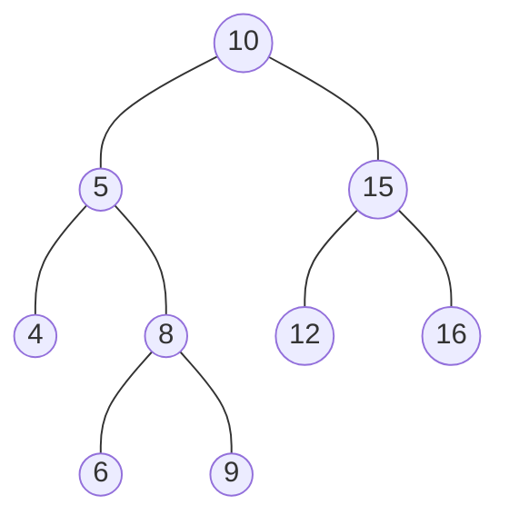
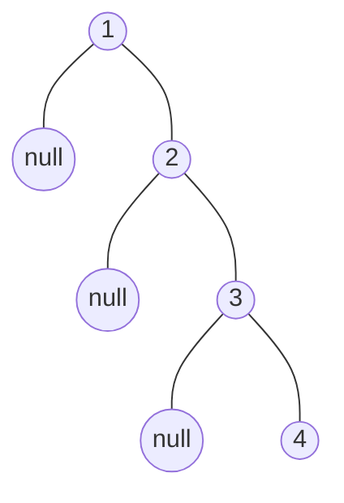

這週是六角鼠年鐵人賽第二十二週。

之前我們已經簡單介紹 **<a href="/posts/2006/ds_tree_and_binary_tree" target="_blank">樹 & 二元樹</a>**，但我們沒有實作它，接下來我們將說明一種最常使用的二元樹資料結構：「**二元搜尋樹（Binary Search Tree）**」，還有實作二元樹的走訪。

<!--more-->



## 二元搜尋樹

**二元搜尋樹（Binary Search Tree, BST）**、**二元搜索樹**，也稱為 **有序二元樹（Ordered binary tree）** 或 **排序二元樹（Sorted binary tree）**，是一種具有特殊性值的二元樹。

### 1. 定義

可以是一棵空樹或者具有下列性質的二元樹：
1. 若任意節點的左子樹不空，則左子樹上所有節點的值均小於它的根節點的值；
2. 若任意節點的右子樹不空，則右子樹上所有節點的值均大於它的根節點的值；
3. 任意節點的左、右子樹也分別為二元搜尋樹。

這個定義可能會出現一些變化：
- 上面的定義，不能允許出現重複的資料。
- 若允許重複的資料，定義會更改成：
  1. 左子樹，小於等於；或是：
  3. 右子樹，大於等於。

這是一顆普通的二元搜尋樹的結構：


## JavaScript 實作二元搜尋樹

### 1. 二元樹的基本結構

實作二元樹通常會用鏈結串列表示法。

二元樹的節點：
```javascript
class BTNode {
  constructor(data) {
    this.data = data;
    this.left = null;
    this.right = null;
  }
}
```
1. `data`：用來存放的資料值；
2. `left`：指向左子樹的指標；
3. `right`：指向右子樹的指標。

二元搜尋樹本體：
```javascript
class BinarySearchTree {
  constructor() {
    this.root = null;
  }
  // methods
}
```

操作方法：
- 二元搜尋樹基本操作：
  1. 搜尋
  2. 新增
  3. 刪除
- 二元樹的走訪操作：
  - DFS：前序、中序、後序
  - BFS：層序

### 2. 搜尋操作

根據 BST 的性質，對於每個節點：
- 若目標值等於節點的值，則回傳節點；
- 若目標值小於節點的值，則繼續在左子樹中搜尋；
- 若目標值大於節點的值，則繼續在右子樹中搜尋；
- 若節點不存在，回傳 `null`。

使用迭代的方式實作：
```javascript
search(data, node = this.root) {
  let curNode = node;
  while (curNode) {
    if (data === curNode.data) {
      return curNode;
    }
    if (data < curNode.data) {
      curNode = curNode.left;
    } else {
      curNode = curNode.right;
    }
  }
  return null;
}
```

使用遞迴實作：
```javascript
search(data, node = this.root) {
  if (!node) {
    return null;
  }
  if (data === node.data) {
    return node;
  }
  if (data < node.data) {
    return this.search(data, node.left);
  }
  return this.search(data, node.right);
}
```

簡化：
```javascript
search(data, node = this.root) {
  if (!node || node.data === data) return node;
  return node.data < data ? this.search(data, node.right) : this.search(data, node.left);
}
```


### 3. 新增操作

新增操作是建立 BST 的基礎操作，有許多不同的做法，但這裡只討論最經典的方式。

與搜尋操作類似，對於每個節點：
- 若不允重複值，目標值等於節點的值時，結束操作。
- 若目標值小於節點的值，則前往左子樹；
- 若目標值大於節點的值，則前往右子樹；
- 若節點為空，設置新節點。


使用迭代實作：
```javascript
insert(data) {
  if (!this.root) {
    this.root = new BTNode(data);
    return;
  }

  let curNode = this.root;
  while (curNode) {
    if (data < curNode.data) {
      if (curNode.left) {
        curNode = curNode.left;
      } else {
        curNode.left = new BTNode(data);
        break;
      }
    } else if (data > curNode.data) {
      if (curNode.right) {
        curNode = curNode.right;
      } else {
        curNode.right = new BTNode(data);
        break;
      }
    } else {
      break;
    }
  }
}
```
- 先判斷樹是否為空樹，若是，則將新節點設為根節點，新增結束；否則：
- 判斷當前節點，預設為根節點：
  1. 若小於當前節點資料，判斷左子樹是否存在：
     - 存在，將當前節點設為左子樹，重新判斷。
     - 不存在，將右子樹設為新節點，新增結束。
  2. 若大於當前節點資料，判斷右子樹是否存在：
     - 存在，將當前節點設為右子樹，重新判斷。
     - 不存在，將右子樹設為新節點，新增結束。。
  3. 若等於當前節點資料，新增失敗。

使用遞迴實作：
```javascript
insert(data) {
  const insertHelper = (node) => {
    const curNode = node;
    if (data < curNode.data) {
      if (curNode.left) {
        insertHelper(curNode.left);
      } else {
        curNode.left = new BTNode(data);
      }
    } else if (data > curNode.data) {
      if (curNode.right) {
        insertHelper(curNode.right);
      } else {
        curNode.right = new BTNode(data);
      }
    }
  };
  
  if (!this.root) {
    this.root = new BTNode(data);
  } else {
    insertHelper(this.root);
  }
}
```

### ４. 最小值／最大值

尋找最小值節點，就是一直往左子樹移動，直到空子樹，回傳最後一個左子樹：
```javascript
findMin(node = this.root) {
  let currentNode = node;
  while (currentNode && currentNode.left ) {
    currentNode = currentNode.left;
  }
  return currentNode;
}
```

尋找最大值節點，反過來就是一直往右子樹移動，直到空子樹，回傳最後一個右子樹：
```javascript
findMax(node = this.root) {
  let currentNode = node;
  while (currentNode && currentNode.right) {
    currentNode = currentNode.right;
  }
  return currentNode;
}
```

### 5. 刪除操作

在二元搜尋樹刪除一個節點，需要考慮節點的三種情況：
1. 葉子節點（無子樹），直接刪除。
2. 節點有單邊子樹，用子樹代替該節點。
3. 節點有左右兩邊子樹，處理方式為：
    - 尋找被刪除節點鄰近的節點值來代替；
    - 取得鄰近的節點方式：
      - 前驅節點：左子樹取最大值
      - 後繼節點：右子樹取最小值（範例使用它）
    - 接著刪除用來代替的節點。

比較麻煩的是，二元搜尋樹節點是單向的，沒有父節點指標，所以我們需要透過遞迴的方式來更新節點。

```javascript
remove(data) {
  const removeNode = (data, node) => {
    const curNode = node;
    // 1
    if (!curNode) {
      return false;
    }
    // 2
    if (data < curNode.data) {
      curNode.left = removeNode(data, curNode.left);
    // 3
    } else if (data > curNode.data) {
      curNode.right = removeNode(data, curNode.right);
    // 4
    } else {
      // 4.1
      if (!curNode.left && !curNode.right) {
        return null;
      }
      // 4.2
      if (!curNode.left) {
        return curNode.right;
      }
      if (!curNode.right) {
        return curNode.left;
      }
      // 4.3
      const aux = this.findMin(curNode.right);
      curNode.data = aux.data;
      curNode.right = removeNode(aux.data, curNode.right);
    }
    return curNode;
  };
  this.root = removeNode(data, this.root);
}
```

要刪除節點，就比須先找到它：
1. 節點不存在。
2. 小於當前節點資料，前往左子樹；
3. 大於當前節點資料，前往右子樹；
4. 等於當前節點，刪除：
   1. 葉子節點，直接刪除。
   2. 單邊子樹，用子樹代替。
   3. 左右兩邊子樹：
      - 取得右子樹最小值；
      - 替換值；
      - 刪除右子樹最小值節點。

### 6. DFS

DFS 共有三種走訪順序：
- 前序走訪
- 中序走訪
- 後序走訪

>關於走訪，之前在 **<a href="/posts/2006/ds_tree_and_binary_tree" target="_blank">樹 & 二元樹</a>** 有說明。

#### 6.1 遞迴

首先是前序走訪，執行順序為：
1. （N）訪問當前節點 
2. （L）走訪左子樹 
3. （R）走訪右子樹

遞迴：
```javascript
preOrderTraversal() {
  const temp = [];
  preHelper(this.root);
  return temp;

  function preHelper(node) {
    if (node) {
      temp.push(node.data);
      preHelper(node.left);
      preHelper(node.right);
    }
  }
}
```

中序、後序走訪差異不大：
```javascript
inOrderTraversal() {
  const temp = [];
  inHelper(this.root);
  return temp;
  
  function inHelper(node) {
    if (node) {
      inHelper(node.left);
      temp.push(node.data);
      inHelper(node.right);
    }
  };
}

postOrderTraversal() {
  const temp = [];
  postHelper(this.root);
  return temp;
  
  function postHelper(node) {
    if (node) {
      postHelper(node.left);
      postHelper(node.right);
      temp.push(node.data);
    }
  };
}
```

#### 6.2 迭代

我們可以使用堆疊（stack）來模擬遞迴結構。

前序走訪：
```javascript
preOrderTraversal() {
  const temp = [];
  const stack = [];

  if (this.root) {
    stack.push(this.root);
  }

  while (stack.length) {
    const node = stack.pop();
    temp.push(node.data);
    
    if (node.right) {
      stack.push(node.right);
    }
    
    if (node.left) {
      stack.push(node.left);
    }
  }
  return temp;
}
```
因為堆疊是後進先出，因此要先將右子樹推入堆疊再推入左子樹。

中序走訪：
```javascript
inOrderTraversal() {
  const temp = [];
  const stack = [];
  let node = this.root;
  
  while (node || stack.length) {
    while (node) {
      stack.push(node);
      node = node.left;
    }
    
    node = stack.pop();
    temp.push(node.data);
    
    node = node.right;
  }
  return temp;
}
```
先將左子樹全部加入堆疊中，然後逐個取出。


後序走訪可以將前序作法的右子樹與左子樹的堆入順序交換，即 NLR 變成 NRL，最後輸出時反轉陣列，變成 LRN。
```javascript
postOrderTraversal() {
  const temp = [];
  const stack = [];

  if (this.root) {
    stack.push(this.root);
  }

  while (stack.length) {
    const node = stack.pop();
    temp.push(node.data);
    if (node.left) {
      stack.push(node.left);
    }
    if (node.right) {
      stack.push(node.right);
    }
  }
  return temp.reverse();
}
```

#### 6.3 輸出

這是二元搜尋樹結構：


輸出：
```javascript
const nums = [10, 5, 4, 8, 6, 9, 15, 12, 16];

const BST = new BinarySearchTree();
for (const data of nums) {
  BST.insert(data);
}

console.log( BST.preOrderTraversal() );
// [ 10, 5, 4, 8, 6, 9, 15, 12, 16 ] 

console.log( BST.inOrderTraversal() );
// [ 4, 5, 6, 8, 9, 10, 12, 15, 16 ]  

console.log( BST.postOrderTraversal() );
// [ 4, 6, 9, 8, 5, 12, 16, 15, 10 ] 
```

二元搜尋樹使用不同順序的走訪，有不同的功能：
- 使用先序走訪，可以結構化輸出。
- 使用中序走訪，可以從小到大輸出，具有排序的功能。
- 使用後序走訪，可以用於計算有層級關係的所有元素的大小。

### 7. BFS

層序走訪會先訪問離根節點最近的節點，也就是它會由上而下，並在同一個階層，由左至右依序訪問節點。

通常會使用佇列（queue）來實現：
```javascript
levelorderTraversal() {
  const temp = [];
  const queue = [];
  
  if (this.root) {
    queue.push(this.root);
  }
  
  while(queue.length) {
    const node = queue.shift();
    temp.push(node.data);
    if(node.left) {
      queue.push(node.left);
    }
    if(node.right) {
      queue.push(node.right);
    }
  }
  return temp;
}
```

層序走訪會依照階層，由左至右依序訪問節點：
```javascript
console.log( BST.levelorderTraversal() );
// [ 10, 5, 15, 4, 8, 12, 16, 6, 9 ] 
```

我們可以稍作修改，用陣列存儲每一層的節點：
```javascript
levelorderTraversal() {
  const temp = [];
  const queue = [];

  if (this.root) {
    queue.push(this.root);
  }

  while (queue.length) {
    const subTemp = [];
    const len = queue.length;

    for (let i = 0; i < len; i += 1) {
      const node = queue.shift();
      subTemp.push(node.data);
      if (node.left) {
        queue.push(node.left);
      }
      if (node.right) {
        queue.push(node.right);
      }
    }

    temp.push(subTemp);
  }
  return temp;
}
```
```javascript
console.log( BST.levelorderTraversal() );
// [ [ 10 ], [ 5, 15 ], [ 4, 8, 12, 16 ], [ 6, 9 ] ] 
```

## 總結

### 1. 分析

二元搜尋樹的新增、搜尋、刪除操作時間複雜度會根據樹的高來決定，最佳、平均的時間複雜度為 $O(\log n)$。

但二元搜尋樹最大的問題就是，它會出現極端情況，傾斜某一邊。舉例來說，當我們順序新增元素，二元搜尋樹會退化成鏈結串列，元素數量多少，樹高就是多少，造成新增、搜尋、刪除操作最差時間複雜度為 $O(n)$。

舉例，依序輸入`1 2 3 4`：


### 2. 將二元搜尋樹變平衡

如果要將一棵傾斜的二元搜尋樹變得平衡，可以這樣處理：
1. 對二元搜尋樹執行的中序走訪取得有序的陣列；
2. 利用有序的陣列，重建一棵平衡的二元搜尋樹：
   - 從陣列的中間位置取一個元素，得到樹的根節點。
   - 對陣列的左邊和右邊遞迴執行相同操作，得到根節點的左、右子樹。

```javascript
balanceBST() {
  const nodeList = this.inOrderTraversal();
  const { length } = nodeList;
  if (length < 3) {
    return this.root;
  }

  this.root = rebuild(0, length - 1);

  function rebuild(start, end) {
    if (start > end) {
      return null;
    }
    const mid = Math.floor((start + end) / 2);
    const node = new BTNode(nodeList[mid]);
    node.left = rebuild(start, mid - 1);
    node.right = rebuild(mid + 1, end);
    return node;
  }
}
```

### 3. 平衡樹

為了避免二元搜尋樹出現極端情況，有人發明了「**平衡樹（Balanced Tree）**」，它能在新增節點時，自動平衡，下週詳細說明。

### 4. 視覺化

這是我用 Vue.js 製作的，可以很方便的觀察二元搜尋樹結構變化：
<iframe height="800" style="width: 100%;" scrolling="no" title="Binary Search Tree with Vue.js" src="https://codepen.io/chupai/embed/PoZPajW?height=265&theme-id=dark&default-tab=result" frameborder="no" allowtransparency="true" allowfullscreen="true">
  See the Pen <a href='https://codepen.io/chupai/pen/PoZPajW'>Binary Search Tree with Vue.js</a> by Chupai@Design
  (<a href='https://codepen.io/chupai'>@chupai</a>) on <a href='https://codepen.io'>CodePen</a>.
</iframe>
