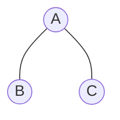
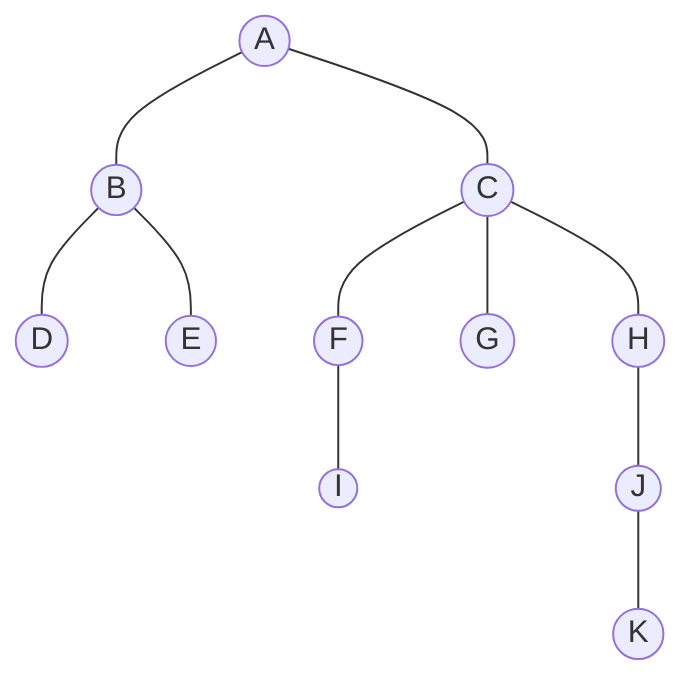
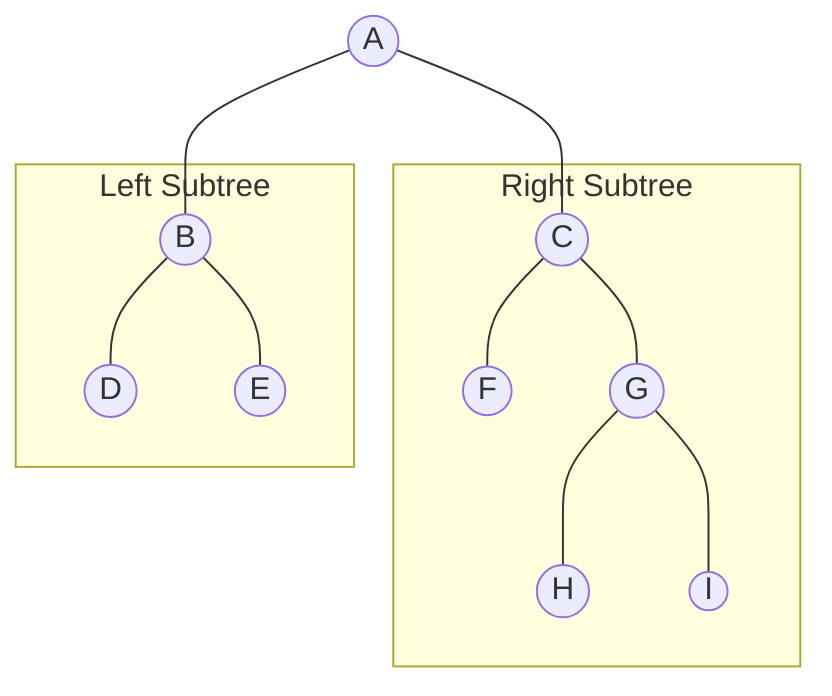
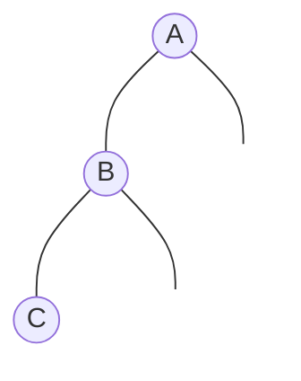
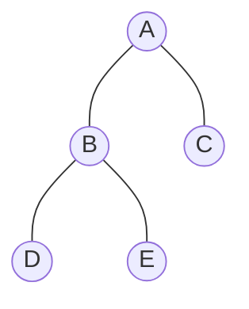
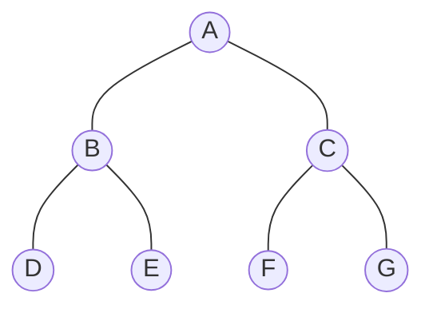
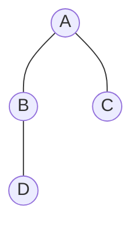
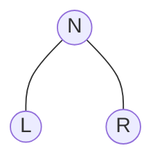
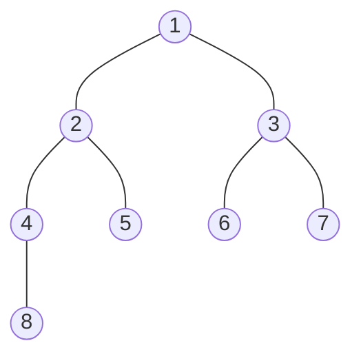

這週是六角鼠年鐵人賽第二十週，經典的排序演算法還有一個 **堆積排序**，再說明堆積排序前，先來看之前還沒提到的樹狀資料結構，之後才比較好理解 **堆積排序**。

<!--more-->



## 樹（Tree）

**樹（Tree）**，是一種模擬現實生活中的樹幹和樹枝的資料結構。屬於一種階層架構的非線性資料結構。

生活中常見樹狀結構資料，例如：家族族譜、決策模型、淘汰賽比賽圖等等。對於前端工程師來說，我們最常操作的 DOM 就是樹狀結構資料。

### 1. 樹的基本觀念

在樹狀結構中的最基本單位，稱為 **節點（Node）**，節點之間的連結即樹的 **分支（Branch）**。



樹的起點稱為 **根節點（Root）**，具有唯一性，例如 A 即根節點。樹根延展出去就是樹枝，也就是根節點可以分支 0 至 n 個節點，分支出去的節點為 **子節點（Child）**。



在樹枝下一樣可以擁有下一層樹枝，D 和 E 為 B 的子節點，B 為 D 和 E 的 **父節點（Parent）**。B 和 E 因為父節點相同，兩者為 **兄弟節點（Siblings）**。從根節點到某節點 **路徑（Path）** 上的所有節點都是此節點的 **祖先節點（Ancestor）**，例如 K 的祖先節點就包含 J、H、C、A。反之，某節點底下的所有節點稱為 **後代節點（Descendant）**。

節點和其子節點可以構成 **子樹（Subtree）**，例如 B、D、E 就形成一棵子樹。

沒有子節點的節點稱為 **葉節點（Leaf）** 或 **外部節點（External）**，例如 D、E、I、G、K。其餘有子節點的節點則稱作 **分支（Branch）節點** 或 **內部節點（Internal）** ，而一個節點擁有的子節點數量稱作 **分支度（Degree）**。

節點的 **階層（Level）** 是從根開始定義起，根為第一層，根的子為第二層，以此類推，例如根節點於 1 階層，而 D 位於 3 階層。

節點 **深度（Depth）** 為一個節點至根節點的距離，例如根節點的深度為 0，D 的深度為 2。階層與深度的關係為：`Level = Depth + 1`。

一個節點至某個葉節點的最長距離則稱作 **節點高度（Height of node）**，例如 F 的高度為 1、C 的高度為 3，所有葉節點的高度為 0。根節點的高度等同 **樹高（Height of tree）**，也等同 **樹的深度（Depth of tree）**。



注意，有部分的文獻會將根節點的 **階層（Level）** 定義為 0，也就是等同於 **深度（Depth）**。


### 2. 樹的特點

樹是由一個或多個節點所組成的有限集合，並且有以下特點：
1. 存在且只有一個 **根節點（Root）**；
2. 樹裡面不存在 **環路（Cycle）**，若要尋找特定節點，只存在一條 **路徑（Path）**；
4. 除了根節點外，每個節點只會有一個 **父節點（Parent）**。
5. 除了根節點外，每個子節點可以分為多個不相交的子樹。

環路（Cycle），指的是樹在各節點之間不可以有迴圈，或不連結的左、右子樹。


### 3. 樹的種類

除非特別指明，一般的樹都是 **有序樹（OrderedTree）**，是指樹中任意節點的子節點之間有順序關係，每個結點的各子樹看成是從左到右有次序的（即不能互換），常見的有以下幾種：
- 二元樹（Binary tree）
- 二元搜尋樹（Binary Search Tree）
- AVL-Tree
- 紅黑樹（Red–black tree）

  
另外還有 **無序樹（UnoderedTree）**，又稱「自由樹」，樹中任意節點的子節點之間沒有順序關係。

## 什麼是二元樹

樹依不同分支度（Degree）可以區分程很多種，在資料結構中，最廣泛使用的樹狀結構就是 **二元樹（Binary tree）**。

**二元樹（Binary tree）**，簡單來說就是限制每個節點最多只能有兩個的子節點，也就是節點分支度只能小於等於 2。

二元樹特點：
- 可以為空集合；
- 分支度只能小於等於 2；
- 子樹有左、右方向的分別。

### 1. 左子樹與右子樹

非空集合的二元樹由三個元素組合：
- 根節點（Root）
- 左子樹（Left Subtree）
- 右子樹（Right Subtree）



### 2. 歪斜樹

歪斜樹（Skewed Tree），指一棵樹完全沒有左或右其中一邊節點的二元樹，如果集中左邊稱作「左歪斜樹」，反之集中右邊稱作「右歪斜樹」。



### 3. Strictly binary tree

Strictly binary tree，指的是每個節點的子節點只能是 0 或 2 的二元樹，簡單來說就是「除了葉節點以外，每個節點都有兩個子節點」。



### 4. Perfect binary tree

Perfect binary tree，指的是每一層上的節點數都是最大節點的二元樹。一棵深度為 k 的樹，它的總節點數量為 $2^{k+1} - 1$。特點是



這是一棵深度為 2 的樹，它的總節點數量為 $2^{2+1} - 1 = 7$。

### 5. Complete binary tree

Complete tree，指的是一棵二元樹中，除了最後一層，其餘層都是滿的二元樹，最後一階層的節點必須由左至右填入。

若樹的深度為 k，那麼至少有 $2^{k}$ 個節點，最多有 $2^{k+1} - 1$個節點。



這是一棵深度為 2 的樹，它至少有 $2^{2} = 4$ 的節點。

### 6. Full Binary tree

Full Binary tree 定義基本上等同於 Strictly binary tree。但中文資料對於 Full Binary tree 的定義，大多數等同 Perfect binary tree。關於這部分的差異我就不知道為什麼了。


## 二元樹的表示法

二元樹在實作上有多種方法可以建立，以下簡單說明最常見的兩種方式。

### 1. 陣列表示法

使用一維陣列儲存，將二元樹的節點根據公式依序放在對應的陣列索引：
- 根節點放在陣列索引位置 0。
- 若節點索引為 `i`：
  - 節點的左子節點，放在陣列索引位置 `(2 * i) + 1`。
  - 節點的右子節點，放在陣列索引位置 `(2 * i) + 2`。
  - 若節點不為根節點，節點的父節點放在陣列索引位置 `(i - 1) / 2`（取商）。

以一棵深度為 2 的 Perfect binary tree 為例：


| 陣列索引 | 0 | 1 | 2 | 3 | 4 | 5 | 6 |
| - | - | - | - | - | - | - | - |
| 節點 | A | B | C | D | E | F | G |

B 節點的索引為 1：
- 左子節點（Ｄ）的索引位置為 `2 * 1 + 1 = 3`
- 右子節點（E）的索引位置為 `2 * 2 + 2 = 4`
- 父節點（A）的索引位置為 `(2 - 1) / 2 = 0`

陣列表示法適合用來儲存 Perfect binary tree，可以快速尋找左右子節點和父節點，但缺點也很明顯：
- 當二元樹稀疏或不平衡時，即使節點不存在，仍然會保留對應的陣列索引位置，因此會造成閒置的空間配置。
- 若增加或刪除節點時，需要移動多個節點。

### 2. 鏈結串列表示法

鏈結串列表示法是用一個節點結構表示樹上的每個節點，結構內除了儲存該節點本身的值，另外有兩個 **指標（Pointer）**，分別指向節點的左子節點和右子節點，沒有子節點則指向 `null`。

| 指標 | 資料 | 指標 |
| --- | --- |--- |
| left | data | right |

鏈結串列表示法，節點新增或刪除容易操作，但尋找父節點較不易，而且當二元樹稀疏或不平衡時，就會浪費指標空間。

## 二元樹的走訪

**二元樹的走訪（Binary tree traversal）**，**走訪（Traversal）** 或稱作 **遍歷**、**搜尋（Search）**，簡單來說就是訪問樹中的每個節點，並執行特定的操作（可能是檢查值、更新、刪除等等）。

二元樹的走訪方式有兩種：
- **深度優先搜尋（Depth-first Search，DFS）**
  由根節點出發，選擇某一子樹並以垂直方向由上到下處理，將其後代節點訪問完後，再選擇另一子樹遞迴地處理。
- **廣度優先搜尋（Breath-first Search，BFS）**
  由根節點出發，以水平方向由左到右處理，將同階層的兄弟節點訪問完畢後，接續處理下一接層的所有節點。

DFS - 前序：


BFS：


### 1. 深度優先搜尋 DFS

走訪一個節點有三個動作：
- （L）走訪左子樹 
- （R）走訪右子樹 
- （N）訪問當前節點 



這三個動作根據執行順序，一共會有 `3! = 6` 種組合：NLR、NRL、LNR、LRN、RNL、RLN。限制只能先走左子樹、再走右子樹，因此只會剩下三種組合：NLR、LNR、LRN。

所以，DFS 根據訪問節點的順序不同，有以下三種類型：
- 前序（Preorder）
- 中序（Inorder）
- 後序（Postorder）



以中序 LNR 為例，執行動作順序：
1. （L）走訪左子樹
2. （N）訪問當前節點
3. （R）走訪右子樹
```
從根節點 1 起步
走訪 1 左樹，2
走訪 2 左樹，4
走訪 4 左樹，8
走訪 8 左樹，空子樹
訪問：8
走訪 8 右樹，空子樹
訪問：4
走訪 4 右樹，空子樹
訪問：2
走訪 2 右樹，5
走訪 5 左樹，空子樹
訪問：5
走訪 5 右樹，空子樹
訪問：1
走訪 1 右樹，3
走訪 3 左樹，6
走訪 6 左樹，空子樹
訪問：6
走訪 6 右樹，空子樹
訪問：3
走訪 3 右樹，7
走訪 7 左樹，空子樹
訪問：7
走訪 7 右樹，空子樹

根據走訪過程，此中序走訪結果為：8 4 2 5 1 6 3 7
```
- 前序 NLR：
  - 執行順序：1 2 4 8 5 3 6 7
- 中序 LNR：
  - 執行順序：8 4 2 5 1 6 3 7
- 後序 LRN：
  - 執行順序：8 4 5 2 6 7 3 1

DFS 通常會使用 **遞迴（Recursion）** 或 **堆疊（Stack）** 實作。

### 2. 廣度優先搜尋 BFS

和深度優先搜尋不同，廣度優先搜尋會先訪問離根節點最近的節點。也就是它會由上而下，並在同一個階層，由左至右依序訪問節點，因此又稱作 **層序走訪（Levelorder Traversal）**。

DFS 通常會使用 **佇列（Queue）** 實作。

## 總結

簡單紀錄樹與二元樹的概念，下週會先說明堆積排序，而樹的實作部分則再之後會使用二元搜尋樹來說明。