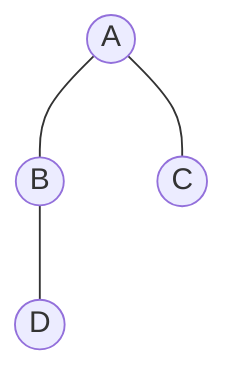
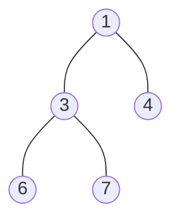
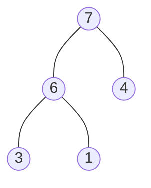
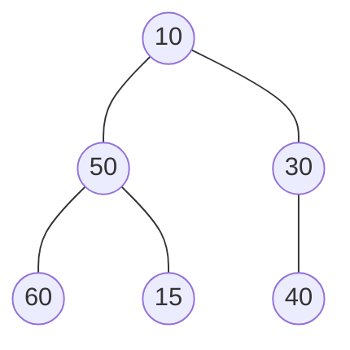
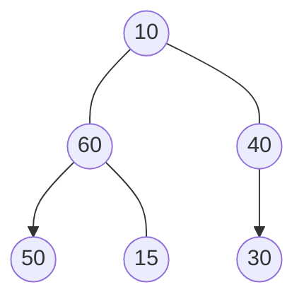
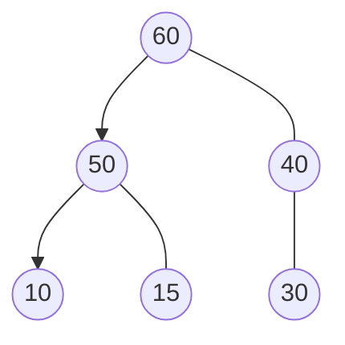
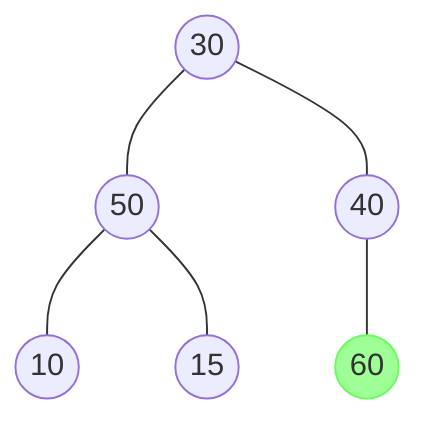
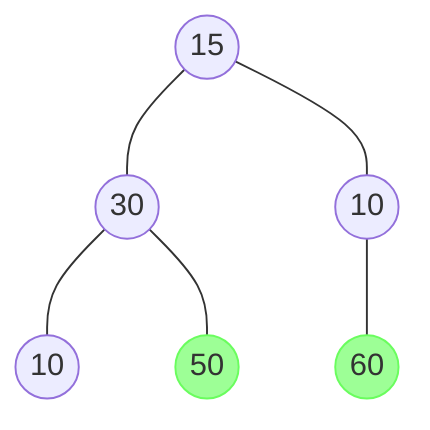
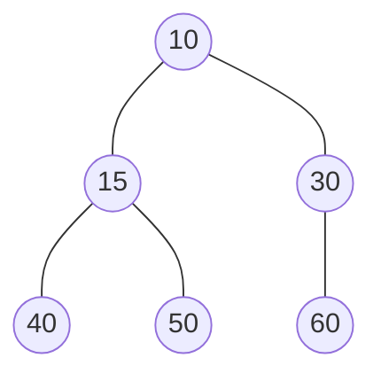

這週是六角鼠年鐵人賽第二十一週，上週已經簡單描述樹狀結構的概念，接下來繼續看排序演算法的 **堆積排序**。

<!--more-->



## 堆積（Heap）

**堆積（Heap）** 是一種用於排序的特殊二元樹，始於 J. W. J. Williams 在 1964年發表的 **堆積排序（Heap sort）**，當時他提出了二元堆積樹作為此演算法的資料結構。

堆積具有以下兩種特性：
- 為 Complete binary tree（完全二元樹），除了最底層，其他層的節點都是填滿的，而且最後一階層的節點必須由左至右填入；
- 任意節點小於（或大於）它的所有後裔，最小元（或最大元）在堆積的根上（堆積序性）。
  - 所有的父節點都比子節點要小，稱作 **最小堆積（Min Heap）**
  - 所有的父節點都比子節點要大，稱作 **最大堆積（Max Heap）**

### 1. Complete binary tree

Complete tree，指的是一棵二元樹中，除了最後一層，其餘層都是滿的二元樹，最後一階層的節點必須由左至右填入。

若樹的深度為 k，那麼至少有 $2^{k}$ 個節點，最多有 $2^{k+1} - 1$個節點。



這是一棵深度為 2 的二元樹，它至少有 $2^{2} = 4$ 的節點。

### 2. 最小堆積

最小堆積，所有的父節點都比子節點要小。



### 3. 最大堆積

最大堆積，所有的父節點都比子節點要大。



## 堆積排序

**堆積排序（Heap sort）** 是指利用 **堆積** 所設計的一種排序演算法。可以看成是 **選擇排序** 的改良版。

流程：
1. 先將資料堆積化（最大或最小）；
2. 然後將第一個元素與最後元素交換位置；
3. 重複上述步驟，直到排序完成。

這裡有一組數列資料：
```
nums = [10, 50, 30, 60, 15, 40]
```

將他轉成 Complete binary tree，結構如下：


接下來我們要將 Complete binary tree 調整成堆積資料結構，如果是遞增排序會調整成最大堆積，遞減排序則調整成最小堆積。

兩者調整過程差異不大，這邊就只說明如何遞增排序。

### 1. 堆積化

首先要取得最後一個父節點位置，如果節點數量為 `n`，那麼最後一個父節點的位置會是 `n / 2`（取商）。

從最後一個父節點開始，由右至左開始比較其子節點，若子節點值大於父節點，則相互對調。

`6 / 2 = 3`，從第三個位置的節點開始：
- 父節點 30
  - 比 40 小，交換位置
- 父節點 50
  - 50、60、15 三者之間左子節點最大，交換位置



接下來，提升了一層，交換後還有子節點，需要繼續往下比較：
- 父節點 10
   - 10、60、40 三者之間左子節點最大，交換位置
   - 10、50、15 三者之間左子節點最大，交換位置
  


### 2. 排序

再來是排序動作，我們將最大堆積的最頂層元素，與最後一個元素交換位置：



如此一來我們的遞增排序就已經排好一個元素了，因此可以將它排除。

接下來我們要繼續維持 **最大堆積**，因此要再次調整樹，最頂層的就會是第二大的：


一樣將它與最後一個元素交換位置後排除：


持續重複上述步驟，直到排序完成：


## 演算法實作

### 1. 將陣列調整成最大堆積

```javascript
function buildMaxHeap(arr) {
  let n = arr.length;
  const lastParent = Math.floor(n / 2) - 1;
  
  for (let i = lastParent; i >= 0; i--) {
    maxHeapify(arr, i, n);
  }
}
```
1. 取得最後一個父節點索引位置。
2. 從最後一個父節開始執行最大堆積調整操作至根節點。


### 2. 最大堆積調整操作：

參數：
- `arr`：待排序陣列。
- `index`：檢查的起始索引位置。
- `heapSize`：目前堆積大小，因為我們直接在原陣列上操作，因此這是用來判斷目前要調整的範圍。

```javascript
function maxHeapify(arr, index, heapSize) {
  const iLeft = 2 * index + 1; // 1
  const iRight = iLeft + 1;    // 2
  let iMax = index;            // 3

  // 4
  if (iLeft < heapSize && arr[iMax] < arr[iLeft]) {
    iMax = iLeft;
  }
  if (iRight < heapSize && arr[iMax] < arr[iRight]) {
    iMax = iRight;
  }
  // 5
  if (iMax !== index) {
    swap(arr, iMax, index);
    maxHeapify(arr, iMax, heapSize);
  }
}
```
1. 左子節點位置。
2. 右子節點位置。
3. 紀錄目前最大節點的位置，預設為當前節點。
4. 首先判斷節點位置是否有超出堆積範圍，再比較是否為最大的。
5. 如果目前最大節點的位置不等於當前節點位置，表示左或右子節點比較大，因此執行交換操作與繼續往下執行調整函式（遞迴操作）。

陣列交換函式：
```javascript
function swap(arr, a, b) {
  let temp = arr[a];
  arr[a] = arr[b];
  arr[b] = temp;
}
```

上面程式碼使用了使用到了遞迴操作，那麼當資料數量非常非常大時，很容易導致 **[堆疊溢位](https://zh.wikipedia.org/wiki/%E5%A0%86%E7%96%8A%E6%BA%A2%E4%BD%8D)**，因此可以改寫用迭代方式：
```javascript
function maxHeapify(arr, index, heapSize) {
  let iLeft;
  let iRight;
  let iMax;
  let iCur = index;

  while (true) {
    iLeft = 2 * iCur + 1;
    iRight = iLeft + 1;
    iMax = iCur;

    if (iLeft < heapSize && arr[iMax] < arr[iLeft]) {
      iMax = iLeft;
    }
    if (iRight < heapSize && arr[iMax] < arr[iRight]) {
      iMax = iRight;
    }
    if (iMax === iCur) {
      break;
    } else {
      swap(arr, iMax, iCur);
      iCur = iMax;
    }
  }
}
```

### 3. 排序操作

```javascript
function heapSort(arr) {

  const n = arr.length;
  buildMaxHeap(arr);    // 1

  // 2
  for (let i = n - 1; i > 0; i--) {
    swap(arr, 0, i);        // 3
    maxHeapify(arr, 0, i);  // 4
  }
}
```
1. 將陣列調整成最大堆積，第一個節點將會是值最大的。
2. 將最後一個節點與第一個節點交換位置，並重新對第一個節點執行堆積調整操作（記得移除已排序好節點）。
3. 交換函式的 `i` 指的是最後一個節點位置。
4. 調整操作的 `i` 指的是目前堆積長度。

## 分析

**堆積排序** 可以看成是 **選擇排序** 的改良版，利用 **堆積** 這種 **半排序（partially sorted）** 的資料結構輔助並加速排序。主要運行時間主要是消耗在初始堆積化與重新堆積化上。

- 不穩定排序
- 時間複雜度
  - 最佳：$O(n \log n)$
  - 最差：$O(n \log n)$
  - 平均：$O(n \log n)$
- 空間複雜度為：$O(1)$
