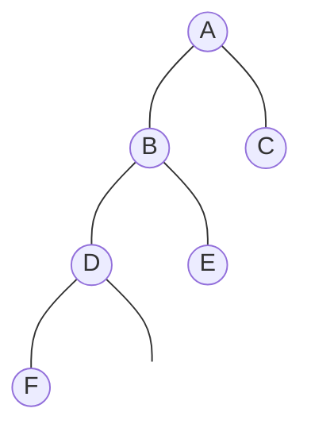
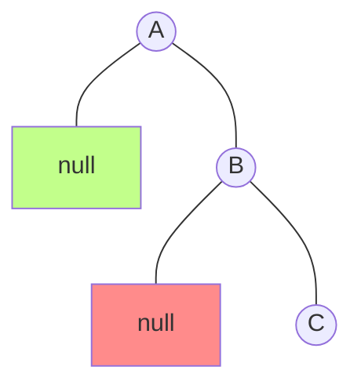
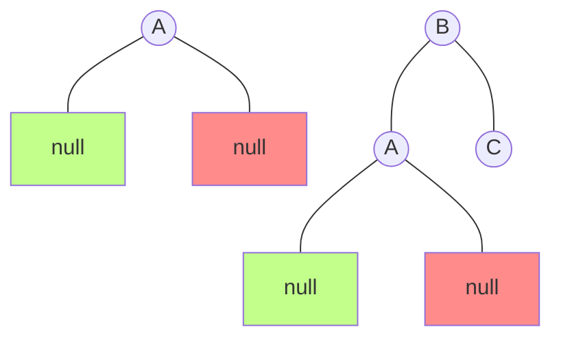
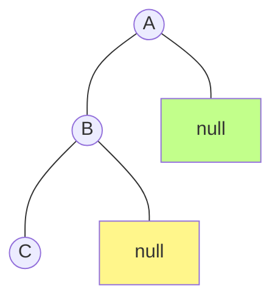
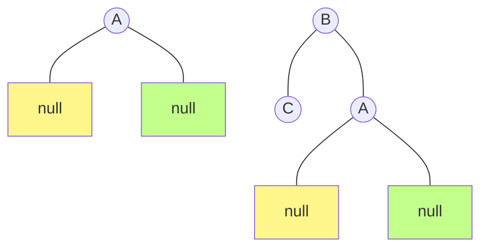
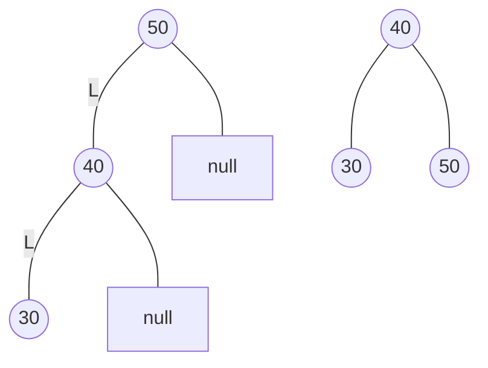
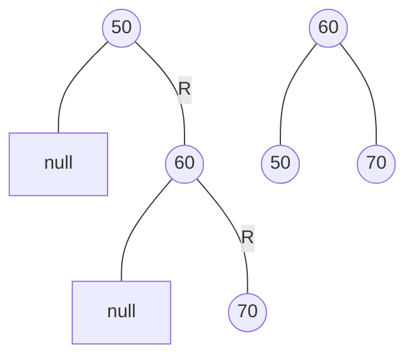
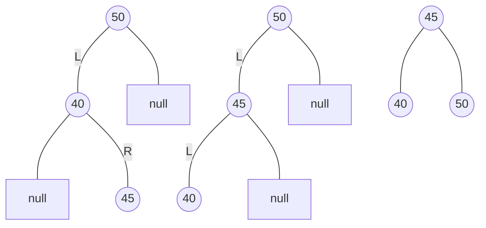
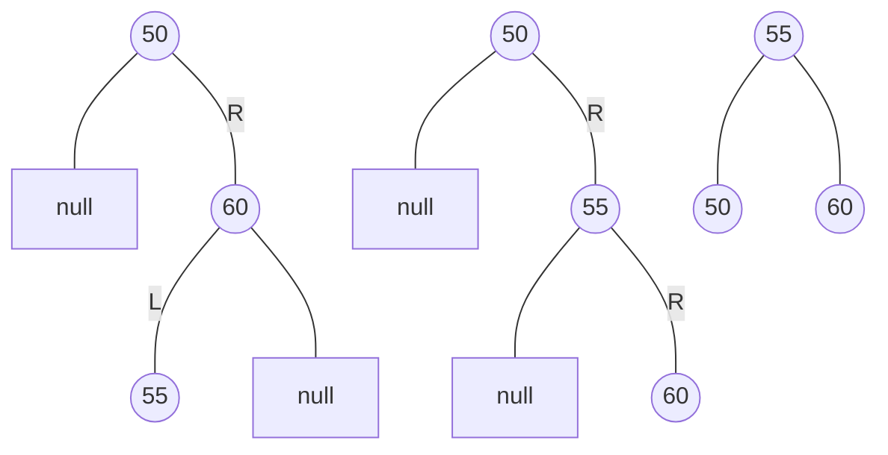

這週是六角鼠年鐵人賽第二十三週。上週我們提到一般的二元搜尋樹如果過度傾斜，會導致查詢的時間複雜度上升，為了實現更高效的查詢，因此就有了「平衡樹」。

<!--more-->



## 平衡樹概述

一般的二元搜尋樹如果過度傾斜，會導致查詢的時間複雜度上升，為了實現更高效的查詢，因此就有了「平衡樹」。

**平衡樹（Balanced Tree）** 是一種結構平衡的二元搜尋樹，其目標在保持每一節點兩邊所含的項目數量相等，故可將根節點至任一葉節點之最長路徑最小化。

「平衡」的意思，其實就是讓整棵樹看起來比較對稱、比較平衡，不會出現左右子樹其中一邊很高或很矮的情況。它能在 $O(\log n)$ 內完成插入、尋找和刪除操作。

常見的平衡樹有：
- AVL-Tree
- 紅黑樹（Red–black tree）
- 樹堆（Treap）

## AVL-Tree

**AVL-Tree** 全名為 **Adelson-Velsky-Landis Tree**，得名於它的發明者 G. M. Adelson-Velsky 和 Evgenii Landis，是最早被發明的平衡樹。

它的任意子節點的左右子樹高度相差不超過 1，所以它也被稱為「高度平衡樹」。大部分的操作與二元搜尋樹相同，差異在於 AVL-Tree 新增或刪除資料時，會進行重新結構化的動作，以保持特性及均勻的搜尋路徑，而不會導致樹過度傾斜。

### 1. 平衡因子 BF

平衡因子（Balanced Factor，BF），節點的平衡因子是它的左子樹的高度減去它的右子樹的高度。

在 AVL-Tree 中，每一節點的平衡因子為 1、0 或 -1。帶有平衡因子 -2 或 2 的節點被認為是不平衡的，需要重新平衡這個樹。負數表示左子樹比右子樹高、正數表示右子樹比左子樹高、零表示左子樹和右子樹等高。

#### 1.1 節點高度公式

節點高度為一個節點至某個葉節點的最長距離，其公式為：

>節點高度 = max(左子節點高, 右子節點高) + 1

子節點為 `null` 時，高度視為 -1。


- F = max(-1, -1) + 1 = 0
- D = max(0, -1) + 1 = 1
- E = max(-1, -1) + 1 = 0
- B = max(1, 0) + 1 = 2
- C = max(-1, -1) + 1 = 0
- A = max(2, 0) + 1 = 3

#### 1.2 平衡因子計算

> 節點的平衡因子 = 左子樹的高度 - 右子樹的高度


- F、E、C 沒有左、右子樹，所以左、右子樹高度為 -1
  - BF = -1 - (-1) = 0  
- D 左樹高度為 0、沒有右樹、
  - BF = 0 - (-1) = 1
- B 左樹高度為 1、右樹高度為 0
  - BF = 1 - 0 = 1
- A 左樹高度為 2、右樹高度為 0
  - BF = 2 - 0 = 2

### 3. 旋轉（Rotation）

幾乎所有平衡樹的操作都基於樹旋轉操作，通過旋轉操作可以使得樹趨於平衡。

首先我們來看基本的旋轉操作，左旋轉和右旋轉，如果：
- BF < -1，表示右子樹比左子樹高超過 1 層，需要做左旋轉。
- BF > 1，表示左子樹比右子樹高超過 1 層，需要做右旋轉。

### 3.1 左旋轉

對 A 做左旋轉：


步驟如下：
1. 將 B 的左節點設為 A 的右節點後；
2. 再將 A 設為 B 的右節點。



#### 3.2 右旋轉

對 A 做右旋轉：


步驟如下：
1. 將 B 的右節點設為 A 的左節點後；
2. 再將 A 設為 B 的右節點。



### 4. 平衡操作

在加入或刪除後，可能會導致二元樹不平衡，我們可以執行旋轉操作，將樹調整成平衡。

請考慮以下四種情況：
- LL 型
- RR 型
- LR 型
- RL 型

四種情況，會不同的調整方式。

#### 4.1 LL 型 & RR 型

這兩種情況是對稱的，所以處理的思路完全是一致的：
- LL 型：當新增的節點在不平衡的節點的左側的左側的時候，需要對不平衡節點執行 **右旋轉**。
- RR 型：當新增的節點在不平衡的節點的右側的右側的時候，需要對不平衡節點執行 **左旋轉**。


LL 型：30 被新增到 50 左節點的左節點，導致二元樹不平衡。對 50 做右旋轉：


RR 型：70 被新增到 50 右節點的右節點，導致二元樹不平衡。對 50 做左旋轉：


#### 4.2 LR 型 & RL 型

- LR 型：當新增的節點在不平衡的節點的左側的右側
    1. 先對不平衡節點的左節點執行 **左旋轉**；
    2. 並將處理好的節點設為不平衡節點的左節點；
    3. 再對不平衡節點執行 **右旋轉**。
- RL 型：當新增的節點在不平衡的節點的右側的左側
    1. 先對不平衡節點的右節點執行 **右旋轉**；
    2. 並將處理好的節點設為不平衡節點的右節點；
    3. 再對不平衡節點執行 **左旋轉**。


LR 型：45 被新增到 50 左節點的右節點，導致二元樹不平衡。先對 40 做左旋轉，會變成 LL 型，再對 50 做右旋轉。


RL 型：55 被新增到 50 節點的左節點，導致二元樹不平衡。先對 60 做右旋轉，會變成 RR 型，再對 50 做左旋轉。



## JavaScript 實作 AVL-Tree 

節點：
```javascript
class Node {
  constructor(data, left = null, right = null) {
    this.data = data;
    this.left = left;
    this.right = right;
  }
}
```

根：
```javascript
class AVLTree {
  constructor() {
    this.root = null;
  }
  // methods
}
```

AVL-Tree 的結構與大部分的方法都與普通二元搜尋樹相同，只有插入、刪除節點完成後，會需要檢查樹是否平衡，因此我們會需要幾個方法來檢查樹是否平衡與平衡操作。


### 1. 計算節點高度 & 計算平衡因子

計算平衡因子需要節點高度，因此我們需要計算節點高度的方法：

```javascript
getNodeHeight(node) {
  if(!node) { return -1; } // 1
  // 2
  const lh = this.getNodeHeight(node.left);
  const rh = this.getNodeHeight(node.right);
  
  return Math.max(lh, rh) + 1; // 3
}
```
1. 子節點為 `null` 時，高度視為 -1。
2. 使用歸迴取得左子節點高、右子節點高。
3. 節點高度 = max(左子節點高, 右子節點高) + 1

計算平衡因子：
```javascript
getBF(node) {
  return this.getNodeHeight(node.left) - this.getNodeHeight(node.right);
}
```
公式：BF = 左子樹的高度 - 右子樹的高度。


### 2. 旋轉操作

LL 型，右旋轉：
```javascript
rotationLL(node) {
  const temp = node.left;
  node.left = temp.right;
  temp.right = node;
  return temp;
}
```

RR 型，左旋轉：
```javascript
rotationRR(node) {
  const temp = node.right;
  node.right = temp.left;
  temp.left = node;
  return temp;
}
```

LR 型，先對節點左子樹左旋轉，再對節點右旋轉：
```javascript
rotationLR(node) {
  node.left = this.rotationRR(node.left);
  return this.rotationLL(node);
}
```

RL 型，先對節點右子樹右旋轉，再對節點左旋轉：
```javascript
rotationRL(node) {
  node.right = this.rotationLL(node.right);
  return this.rotationRR(node);
}
```

### 3. 平衡操作

```javascript
balance(node) {
  if (!node) { return node; }
  const nodeBF = this.getBF(node);
  
  if (nodeBF > 1) {
    if (this.getNodeHeight(node.left.left) >= this.getNodeHeight(node.left.right)) {
      node = this.rotationLL(node);
    } else {
      node = this.rotationLR(node);
    }
  } else if (nodeBF < -1) {
    if (this.getNodeHeight(node.right.right) >= this.getNodeHeight(node.right.left)) {
      node = this.rotationRR(node);
    } else {
      node = this.rotationRL(node);
    }
  }
  return node;
}
```
首先，判斷平衡因子大於 1 還是小於 - 1：
- 大於 1 左子樹高於右子樹；
- 小於 -1 右子樹高於左子樹。

接下來判斷下一個節點哪邊的子樹比較高，並執行對應情況的旋轉操作。


### 4. 新增節點

AVL-Tree 新增節點方式與一般的二元搜尋樹相同，但它最後會檢查樹是否平衡，如果不平衡會執行平衡操作。

```javascript
insert(data) {
  const insertHelper = (node) => {
    if (!node) {
      node = new Node(data);
    } else if (data < node.data) {
      node.left = insertHelper(node.left);
      node = this.balance(node);
    } else {
      node.right = insertHelper(node.right);
      node = this.balance(node);
    }
    return node;
  };

  this.root = insertHelper(this.root);
  return this.root;
}
```

### 5. 刪除節點

刪除節點也與與一般的二元搜尋樹相同，一樣再刪除後檢查樹是否平衡，如果不平衡會執行平衡操作。

```javascript
  remove(data) {
    const removeNode = (data, node) => {
      if (!node) {
        return null;
      }
      if (data === node.data) {
        if (!node.left && !node.right) {
          node = null;
          return node;
        }
        if (!node.left) {
          node = node.right;
          return node;
        } else if (!node.right) {
          node = node.left;
          return node;
        }
        const aux = this.findMin(node.right);
        node.data = aux.data;
        node.right = removeNode(aux.data, node.right);
        return node;
      }
      if (node.data > data) {
        node.left = removeNode(data, node.left);
        node = this.balance(node);
        return node;
      } else {
        node.right = removeNode(data, node.right);
        node = this.balance(node);
        return node;
      }
    };
    this.root = removeNode(data, this.root);
    return this.root;
  }

findMin(node = this.root) {
  let currentNode = node;
  while (currentNode && currentNode.left) {
    currentNode = currentNode.left;
  }
  return currentNode;
}
```

## 總結

<iframe height="800" style="width: 100%;" scrolling="no" title="AVL-Tree Tree with Vue.js" src="https://codepen.io/chupai/embed/BajoEoe?height=265&theme-id=dark&default-tab=result" frameborder="no" allowtransparency="true" allowfullscreen="true">
  See the Pen <a href='https://codepen.io/chupai/pen/BajoEoe'>AVL-Tree Tree with Vue.js</a> by Chupai@Design
  (<a href='https://codepen.io/chupai'>@chupai</a>) on <a href='https://codepen.io'>CodePen</a>.
</iframe>


二元搜尋樹最大的問題就是，它會出現極端情況，造成它可能會有一邊非常的深，因此它的插入、搜尋、刪除操作最差時間複雜度為 $O(n)$。

而 AVL-Tree 再新增和刪除時，就會自動平衡二元樹，因此不會有極端情況發生。因此它的插入、搜尋、刪除操作平均、最差時間複雜度都為 $O(\log n)$。