這週是六角鼠年鐵人賽第二十三週。

二元搜尋樹最大的問題就是，它會出現極端情況，傾斜某一邊，因此它的新增、搜尋、刪除操作最差時間複雜度為 $O(n)$。為了實現更高效的查詢，因此就有人發明了「平衡樹」。

<!--more-->




## 平衡樹概述

**平衡樹（Balanced Tree）** 是二元搜尋樹的改良版本，其目標在保持每一節點兩邊所含的項目數量相等，故可將根節點至任一葉節點之最長路徑最小化。

「平衡」的意思，其實就是讓整棵樹看起來比較對稱、比較平衡，不會出現左右子樹其中一邊很高或很矮的情況。它能在 $O(\log n)$ 內完成新增、搜尋和刪除操作。

常見的平衡樹有：
- **AVL-Tree**：最早被發明的平衡樹，任意子節點的左右子樹高度相差不超過 1，屬於嚴格平衡樹。
- **紅黑樹（Red–black tree）**：相較於 AVL-Tree，犧牲部分平衡（高 1 層），利用節點顏色，減少平衡操作的旋轉次數。
- **樹堆（Treap）**：是有一個隨機附加域滿足堆積的性質的二元搜尋樹，其結構相當於以隨機資料新增的二元搜尋樹。


### 1. 旋轉（Rotation）操作

幾乎所有的平衡樹都是透過 **旋轉（Rotate）** 操作，使得樹趨於平衡。

首先我們來看二元樹基本的旋轉操作，左旋轉和右旋轉：

#### 3.1 左旋轉

對 A 做左旋轉：
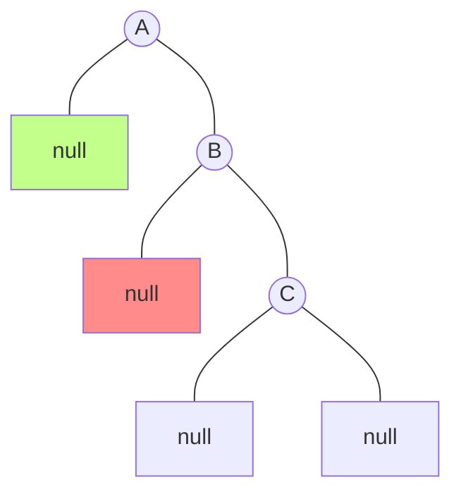

步驟如下：
1. 將 B 的左子節點移動到 A 的右子節點位置；
2. 再將 A 移動到 B 的左子節點位置；

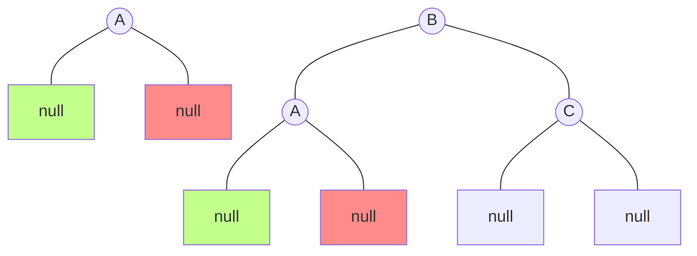
看上去，就像 A 逆時針旋轉。

#### 1.2 右旋轉

對 A 做右旋轉：
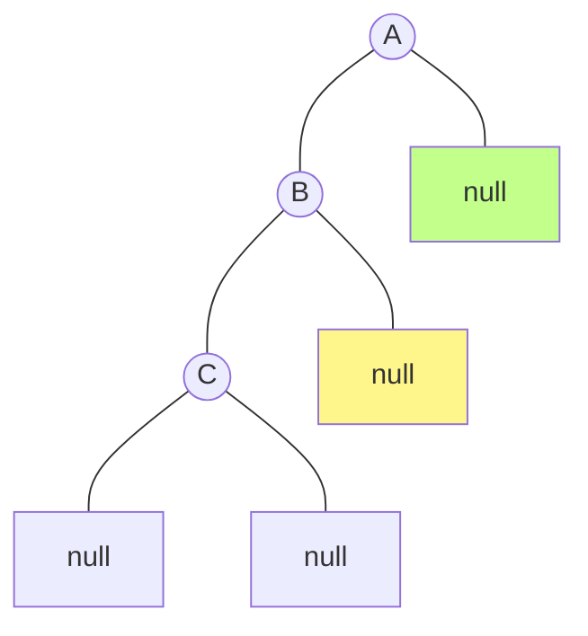

步驟如下：
1. 將 B 的右子節點移動到 A 的左子節點位置；
2. 再將 A 移動到 B 的右子節點位置；

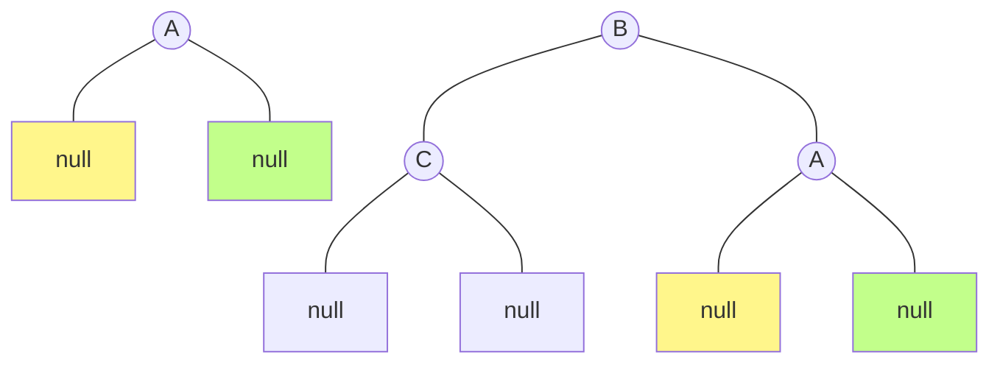
看上去，就像 A 順時針旋轉。


## AVL-Tree

**AVL-Tree** 全名為 **Adelson-Velsky-Landis Tree**，得名於它的發明者 G. M. Adelson-Velsky 和 Evgenii Landis，是最早被發明的平衡樹，因為是二元搜尋樹的優化版，因此又稱作「平衡二元搜尋樹」。

它的任意子節點的左右子樹高度相差不超過 1，所以它也被稱為「高度平衡樹」。

大部分的操作與二元搜尋樹相同，差異在於 AVL-Tree 新增或刪除資料時，會進行平衡操作（重新結構化），以保持性質及均勻的搜尋路徑，而不會導致樹過度傾斜。

### 1. 平衡因子 BF

平衡因子（Balanced Factor，BF）是用來判斷節點的左右子樹高度相差多少。

計算方式為，左子樹的高度減去它的右子樹的高度：
- 負數表示左子樹比右子樹高；
- 正數表示右子樹比左子樹高；
- 零表示左子樹和右子樹等高。

在 AVL-Tree 中，每一節點的平衡因子為 1、0 或 -1。帶有平衡因子 -2 或 2 的節點被認為是不平衡的，需要重新平衡。

#### 1.1 節點高度公式

節點高度為一個節點至某個葉節點的最長距離，其公式為：

>節點高度 = max(左子節點高, 右子節點高) + 1

子節點為 `null` 時，高度視為 -1。

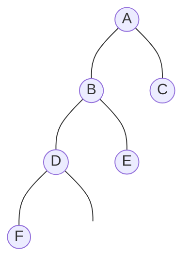
- F Height = max(-1, -1) + 1 = 0
- D Height = max(0, -1) + 1 = 1
- E Height = max(-1, -1) + 1 = 0
- B Height = max(1, 0) + 1 = 2
- C Height = max(-1, -1) + 1 = 0
- A Height = max(2, 0) + 1 = 3

#### 1.2 平衡因子計算

> 節點的平衡因子 = 左子樹的高度 - 右子樹的高度


- F、E、C 沒有左、右子樹，所以左、右子樹高度為 -1
  - BF = -1 - (-1) = 0  
- D 左樹高度為 0、沒有右樹、
  - BF = 0 - (-1) = 1
- B 左樹高度為 1、右樹高度為 0
  - BF = 1 - 0 = 1
- A 左樹高度為 2、右樹高度為 0
  - BF = 2 - 0 = 2


### 2. 平衡操作

新增／刪除操作的平衡操作共有兩種策略：
1. 預判是否影響樹的平衡，先調整樹再執行新增／刪除操作；
2. 或是，執行新增／刪除操作後，再判斷樹是否需要執行平衡操作。

以下使用後者來說明，並使用新增節點為例。

新增／刪除操作後，請考慮以下四種情況，會有不同的調整方式：
1. LL 型
2. RR 型
3. LR 型
4. RL 型

#### 4.1 LL 型 & RR 型

這兩種情況是鏡像的，所以處理的思路完全是一致的：
- LL 型：當新增的節點在不平衡的節點的左側的左側
	- 對不平衡節點執行 **右旋轉**。
- RR 型：當新增的節點在不平衡的節點的右側的右側
	- 對不平衡節點執行 **左旋轉**。

直接看範例。

LL 型：50 因為新增 30 而導致 BF 變成 2，因此需要調整，而 30 位於 50 的 左側的左側。

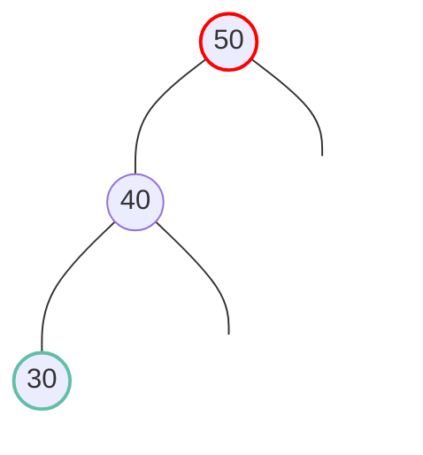

處理方式，對 50 做右旋轉：
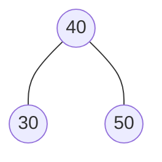

另一種情況，50 因為新增 20 而導致 BF 變成 2，而 20 位於 50 的左側的左側：
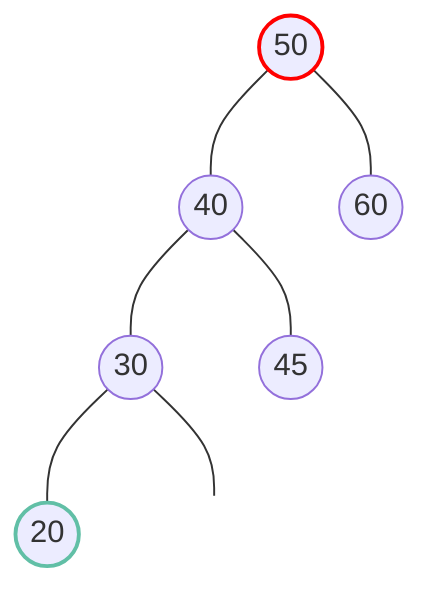

一樣對 50 做右旋轉：
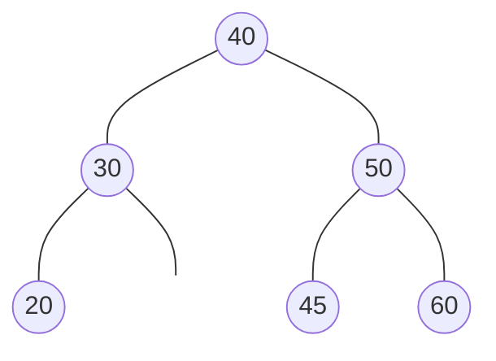

RR 型就是 LL 型的鏡像情況。

#### 4.2 LR 型 & RL 型

這兩種情況是鏡像的，所以處理的思路完全是一致的：
- LR 型：當新增的節點在不平衡的節點的左側的右側
    1. 先對不平衡節點的左子節點執行 **左旋轉**；
    2. 再對不平衡節點執行 **右旋轉**。
- RL 型：當新增的節點在不平衡的節點的右側的左側
    1. 先對不平衡節點的右子節點執行 **右旋轉**；
    2. 再對不平衡節點執行 **左旋轉**。

直接看範例。

LR 型：50 因為新增 45 而導致 BF 變成 2，因此需要調整，而 30 位於 50 的左側的右側。
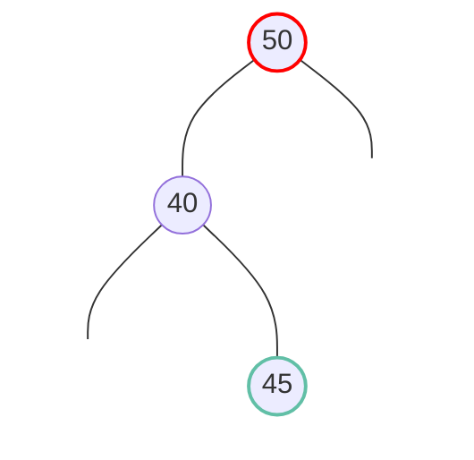

處理方式，先對 40 做左旋轉，會變成 LL 型，再對 50 做右旋轉：
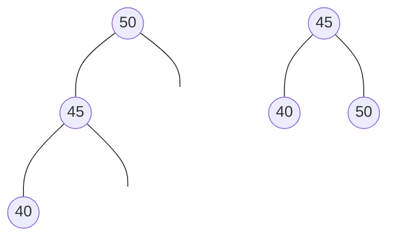

另一種情況，50 因為新增 41 而導致 BF 變成 2，而 41 位於 50 的左側的右側：
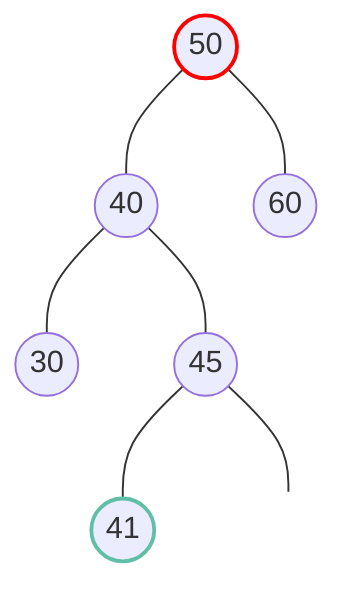

一樣先對 40 做左旋轉，會變成 LL 型，再對 50 做右旋轉：
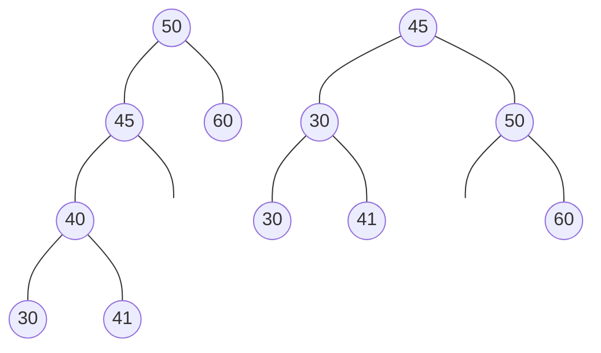

RL 型就是 LR 型的鏡像情況。


## JavaScript 實作 AVL-Tree 

二元樹的節點：
```javascript
class BTNode {
  constructor(data) {
    this.data = data;
    this.left = null;
    this.right = null;
  }
}
```

本體：
```javascript
class AVLTree {
  constructor() {
    this.root = null;
  }
  // methods
}
```


### 1. 計算平衡因子

計算平衡因子需要節點高度，因此我們需要計算節點高度的方法：

```javascript
getNodeHeight(node) {
  if(!node) { return -1; } // 1
  // 2
  const lh = this.getNodeHeight(node.left);
  const rh = this.getNodeHeight(node.right);
  
  return Math.max(lh, rh) + 1; // 3
}
```
1. 子節點為 `null` 時，高度視為 -1。
2. 使用歸迴取得左子節點高、右子節點高。
3. 節點高度 = max(左子節點高, 右子節點高) + 1。

計算平衡因子：
```javascript
getBF(node) {
  return this.getNodeHeight(node.left) - this.getNodeHeight(node.right);
}
```
公式：BF = 左子樹的高度 - 右子樹的高度。


### 2. 旋轉操作

右旋轉：
```javascript
rightRotation(node) {
  const temp = node.left;
  node.left = temp.right;
  temp.right = node;
  return temp;
}
```

左旋轉：
```javascript
leftRotation(node) {
  const temp = node.right;
  node.right = temp.left;
  temp.left = node;
  return temp;
}
```

### 3. 平衡操作

平衡操作，檢查節點是否平衡：
- 若 BF > 1，表示不平衡，且左子樹高於右子樹，判斷是 LL、還是 LR：
  1. 若是 LR 型：
     - 先對不平衡節點的左子節執行左旋轉，變成 LL 型；
  2. LL 型，對不平衡節點執行右旋轉。 
- 若 BF < -1，表示不平衡，且右子樹高於左子樹，判斷是 RR、還是 RL：
  1. 若是 RL 型：
     - 先對不平衡節點的左子節執行右旋轉，變成 LL 型；
  2. RR 型，對不平衡節點執行左旋轉。

判斷新增的節點是被加在左側還是右側，可以計算左、右子樹哪邊高，就能知道加在哪邊，因此我們可以計算 BF，若是負的右子樹高，反之，正的左子樹高。

```javascript
balance(node) {
  if (!node) {
    return node;
  }
  const nodeBF = this.getBF(node);
  if (nodeBF > 1) {
    if (this.getBF(node.left) < 0) {
      node.left = this.leftRotation(node.left);
    }
    node = this.rightRotation(node);
  } else if (nodeBF < -1) {
    if (this.getBF(node.right) > 0) {
      node.right = this.rightRotation(node.right);
    }
    node = this.leftRotation(node);
  }
  return node;
}
```

### 4. 新增操作

新增節點後，需要檢查節點至根節點這條路徑，是否符合平衡條件，因此我們可以使用遞迴的方式回頭檢查節點是否符合平衡：

```javascript
insert(data) {
  const insertHelper = (node) => {
    let curNode = node;
    if (!curNode) {
      return new BTNode(data);
    }
    if (data < curNode.data) {
      curNode.left = insertHelper(curNode.left);
    } else if (data > curNode.data) {
      curNode.right = insertHelper(curNode.right);
    }
    curNode = this.balance(curNode);
    return curNode;
  };
  this.root = insertHelper(this.root);
}
```


### 5. 刪除節點

刪除操作與普通的二元素搜尋樹相同，刪除節點後，檢查節點至根節點這條路徑，是否符合平衡條件：
```javascript
remove(data) {
  const removeNode = (data, node) => {
    let curNode = node;    // let

    if (!curNode) {
      return false;
    }

    if (data < curNode.data) {
      curNode.left = removeNode(data, curNode.left);

    } else if (data > curNode.data) {
      curNode.right = removeNode(data, curNode.right);

    } else {

      if (!curNode.left && !curNode.right) {
        return null;
      }

      if (!curNode.left) {
        return curNode.right;
      }
      if (!curNode.right) {
        return curNode.left;
      }

      const aux = this.findMin(curNode.right);
      curNode.data = aux.data;
      curNode.right = removeNode(aux.data, curNode.right);
    }
    curNode = this.balance(curNode);  // new
    return curNode;
  };
  this.root = removeNode(data, this.root);
}
```

## 總結

### 1. 分析

二元搜尋樹最大的問題就是，它會出現極端情況，傾斜某一邊，因此它的新增、搜尋、刪除操作最差時間複雜度為 $O(n)$。

而 AVL-Tree 再新增和刪除時，就會自動平衡二元樹，因此不會有極端情況發生。因此它的新增、搜尋、刪除操作平均、最差時間複雜度都為 $O(\log n)$。

### 2. 平衡操作時間複雜度

平衡操作是透過旋轉 1 次或 2 次來降低樹高。

新增操作因為是增加樹高，而造成樹不平衡，因此最多只需要執行 1 次平衡操作即可平衡整棵樹（最多旋轉 2 次），所以新增的平衡操作時間複雜度為 $O(1)$。

但刪除操作是因為降低樹高，而造成樹不平衡，因此執行平衡操作後，父節點可能又會不平衡，要再次執行平衡操作，所以最糟的情況下需要執行多次平衡操作，時間複雜度為 $O(\log n)$。

我們下週要講的**紅黑樹**的刪除平衡操作可以在 3 次旋轉內完成平衡操作。

### 3. 視覺化

這是我用 Vue.js 製作的，可以很方便的觀察 AVL-Tree 結構變化：

<iframe height="800" style="width: 100%;" scrolling="no" title="AVL-Tree Tree with Vue.js" src="https://codepen.io/chupai/embed/BajoEoe?height=265&theme-id=dark&default-tab=result" frameborder="no" allowtransparency="true" allowfullscreen="true">
  See the Pen <a href='https://codepen.io/chupai/pen/BajoEoe'>AVL-Tree Tree with Vue.js</a> by Chupai@Design
  (<a href='https://codepen.io/chupai'>@chupai</a>) on <a href='https://codepen.io'>CodePen</a>.
</iframe>
