這週是六角鼠年鐵人賽第二十四週。接下來我們來看與 AVL-Tree 一樣是自平衡二元搜尋樹的「紅黑樹」，因為比較難理解篇幅較長，所以分成三個階段來說明：
1. [紅黑樹（上）：2-3 樹、2-3-4 樹](/posts/2007/ds_redblack-tree-1)
2. [紅黑樹（中）：紅黑樹的插入、刪除操作](/posts/2007/ds_redblack-tree-2)
3. [紅黑樹（下）：JavaScript 實作紅黑樹](/posts/2007ds_redblack-tree-3)

<!--more-->



## 紅黑樹簡介

**紅黑樹（Red–black tree）** 是一種自平衡二元搜尋樹，它是由 Rudolf Bayer 於 1972年發明，當時稱為 **對稱二元 B 樹（Symmetric binary B-trees）**。後來因為 Leo J. Guibas 和 Robert Sedgewick 於 1978年寫的一篇論文改名成現今的名稱。

### 1. 性質

首先我們來看定義**紅黑樹**規則的五點性質：
1. 任何一個節點非紅即黑；
2. 樹的根節點為黑色；
3. 葉子節點為黑色（NIL）；
4. 每個紅色節點必須有兩個黑色的子節點（不能有兩個連續的紅色節點）；
5. 從任一節點到其每個 NIL 的所有簡單路徑都包含相同數目的黑色節點。

紅黑樹就是利用第 4、5 點性質來保持平衡的。


在**紅黑樹**中，葉子節點的定義是指的是最後的空值節點，稱作「NIL」，而不是沒有子節點的節點。


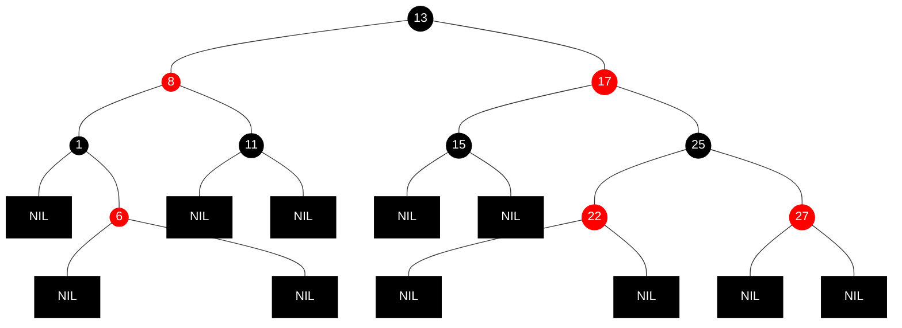

### 2. 說明紅黑樹操作前

**紅黑樹**如果直接依照性質來說明它的操作，會非常抽象難理解。

因此再說明**紅黑樹**之前，必須先理解什麼是「**2-3 樹**」與「**2-3-4 樹**」，因為**紅黑樹**是 **2-3-4 樹**的一種實現方式，對於理解**紅黑樹**有很大的幫助。

## 2-3 樹
**<a href="https://zh.wikipedia.org/wiki/2-3%E6%A0%91" target="_blank">2-3 樹</a>** 全名稱「**2-3 B 樹**」，是階為 3 的 **<a href="https://zh.wikipedia.org/wiki/B%E6%A0%91" target="_blank">B 樹</a>**，是一種自平衡搜尋樹，而且是一棵絕對平衡的樹，但它不是一棵二元樹。

### 1. 性質

基本性質：
1. 滿足二元搜尋樹的基本特性。
2. 節點可以存放 1 個或 2 個元素。
3. 當節點存放 1 個元素時，稱作「2-節點」，可以有 2 個子節點。
4. 當節點存放 2 個元素時，稱作「3-節點」，可以有 3 個子節點。
5. 所有葉子點都在樹的同一層（絕對平衡）。

**2-節點**，即一般的二元搜尋樹節點，左子節點小於父節點，右子節點大於父節點：
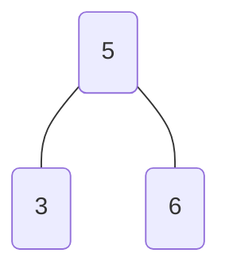

**3-節點**，可以看作是擴充版，可以存放 2 個元素，中間的子節點存放 2 個元素之間的元素：
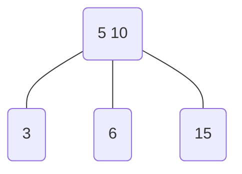

### 2. 絕對平衡

**2-3 樹**是一棵絕對平衡的樹，「絕對平衡」指的是對於任意一個節點，左右子樹高度相同，也就是說，節點不是沒子節點，就是子節點全滿。

### 3. 操入操作

接下來，將說明如何在插入過程中，維護 **2-3 樹**的絕對平衡。

#### 3.1 向空樹插入元素

首先，對一棵空樹，插入一個元素，那麼會產生樹的根節點：
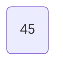

#### 3.2 向 2-節點插入元素

再插入一個元素時，不會像二元搜尋樹一樣，插入到空節點中。而是「融合」到節點中，變成一個「3-節點」：
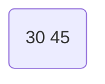

#### 3.3 向 3-節點插入元素

繼續插入一個元素，此時節點會變成一個 4-節點：
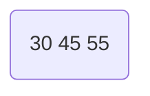

4-節點不符合 **2-3 樹**性質，因此會執行「拆分」操作，變成一棵二元樹，使 **2-3 樹**保持基本性質：
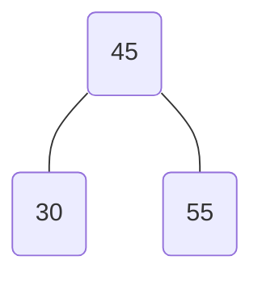

#### 3.4 向父節點為 2-節點的 3-節點插入

如果繼續插入元素 20，直接融合到節點中，但再插入元素 15，又會出現一個 4-節點：
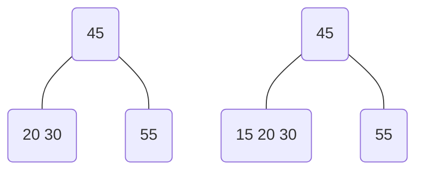

我們一樣執行拆分操作，但拆分後樹無法保持絕對平衡：
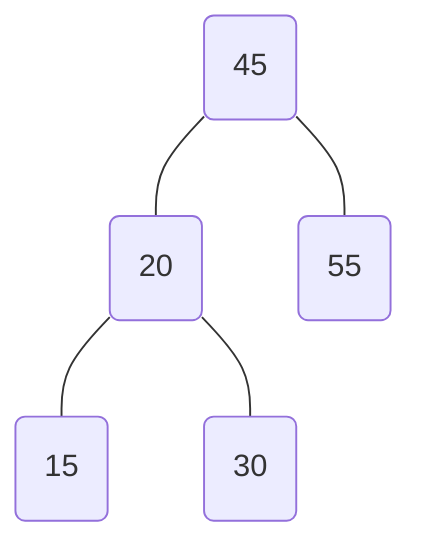

因此還需要將拆分後的子樹「向上融合」節點，使樹保持絕對平衡：
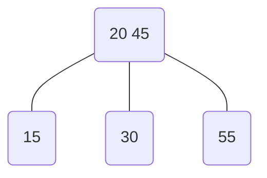

#### 3.5 向父節點為 3-節點的 3-節點插入

如果繼續插入元素 10 一樣會直接融合到節點中，再插入元素 5，一樣又出現一個 4-節點：
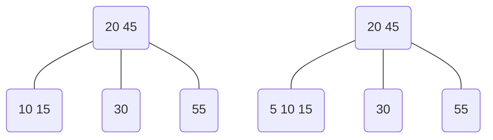

一樣對這個 4-節點執行拆分與融合操作，但向上融合後，父節點也變成一個 4-節點了：
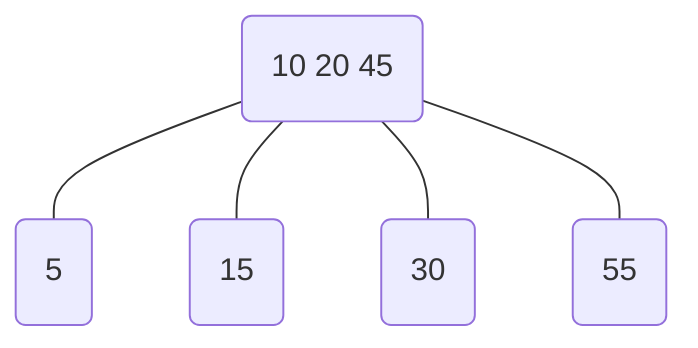

因此要繼續對這個 4-節點執行拆分操作：
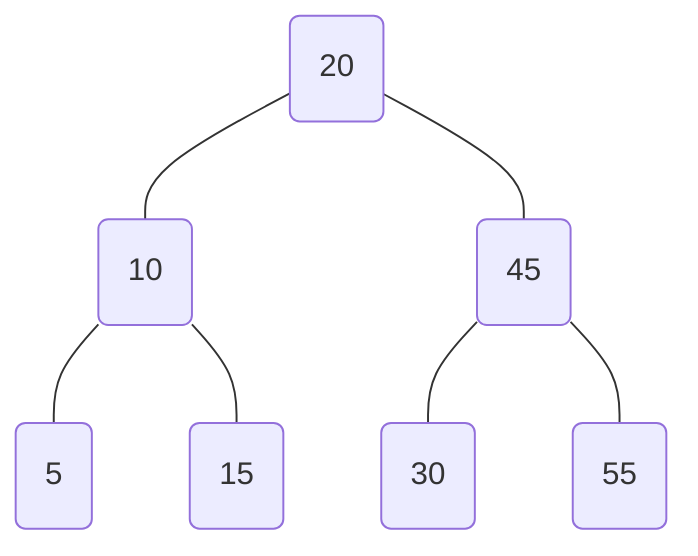

#### 3.6 插入操作一定是在葉子節點中進行

你可以發現，上面的範例插入的元素都越來越小，也就說換成一般的二元搜索樹，樹會偏左傾斜，但 **2-3 樹** 依然保持絕對平衡。

但如果插入兩個元素之間值的元素呢？如果插入元素 35，也就是 30 與 45 之間的值，是融合在 45 還是 30 的節點中？


「插入操作一定是在葉子節點中進行」，因此元素 35 會與 30 的節點融合，而不是元素 45：
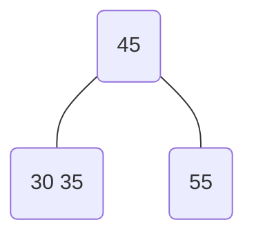

#### 3.7 插入操作總結

1. 插入操作一定是在葉子節點中進行。
2. 空樹，插入後成為根節點。
3. 非空樹，則與目標節點融合。
4. 若融合後目標節點變成 4-節點，需要執行拆分與向上融合操作；
5. 若原本父節點為 3-節點，因為向上融合操作而變成 4-節點，則繼續進行拆分與向上融合操作，直到沒有 4-節點。


## 2-3-4 樹

**<a href="https://zh.wikipedia.org/wiki/2-3-4树" target="_blank">2-3-4 樹</a>** 就是基於 **2-3樹**的擴展，將節點擴充到 4-節點，是階為 4 的 **<a href="https://zh.wikipedia.org/wiki/B%E6%A0%91" target="_blank">B 樹</a>**。

### 1. 插入操作

**2-3-4 樹** 插入元素與 **2-3 樹** 相同，插入操作一定是在葉子節點中進行，一樣是將它融合到節點中，只要不是 4-節點，可以直接與該節點融合。

對一個 4-節點插入元素，就會產生 5-節點，會進行以下處理：
1. 先拆分 4-節點；
2. 再融合插入元素；
3. 將這個子樹向上融合，但向上融合之前，必須檢查父節點是否也是 4-節點，若是就重複之前操作。

我們直接來看一個連續 4-節點的例子，假如要插入元素 10，會融合在紅色框的這個 4-節點中：
```mermaid
graph TB;
  A[50 60 80] --- B[20 30 40] & C[55] & D[70] & E[90 100];
  classDef red, fill:black,stroke:black,color:white;
  classDef red stroke:red;
  B:::red;
```

因此我們需要先將它拆分一棵二元樹：
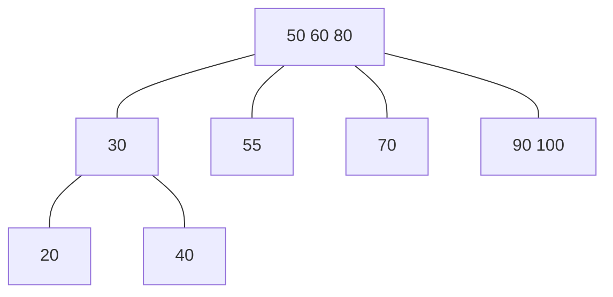

將元素 10 插入到拆分後的子樹中：
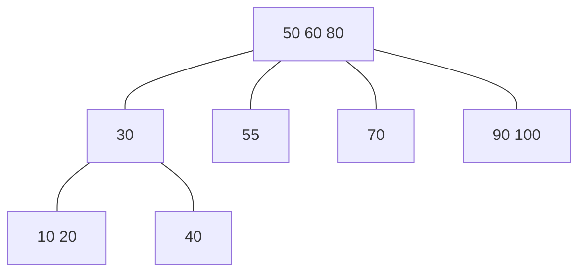

再將子樹向上融合之前，需要檢查父節點是否也是 4節點，如果是，一樣將它拆分：
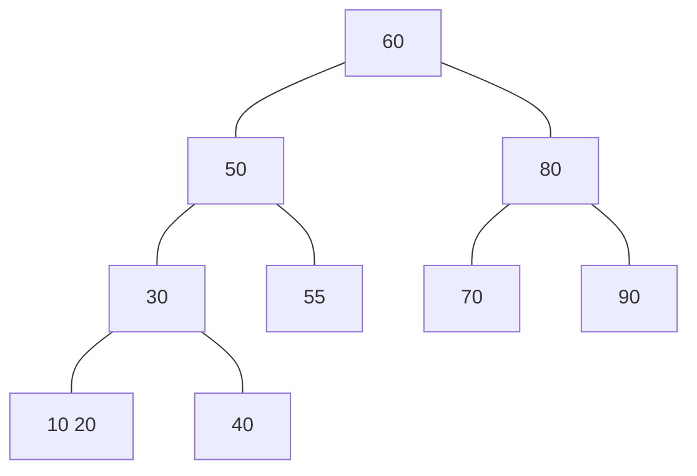

接著就可以將之前的子樹向上融合：
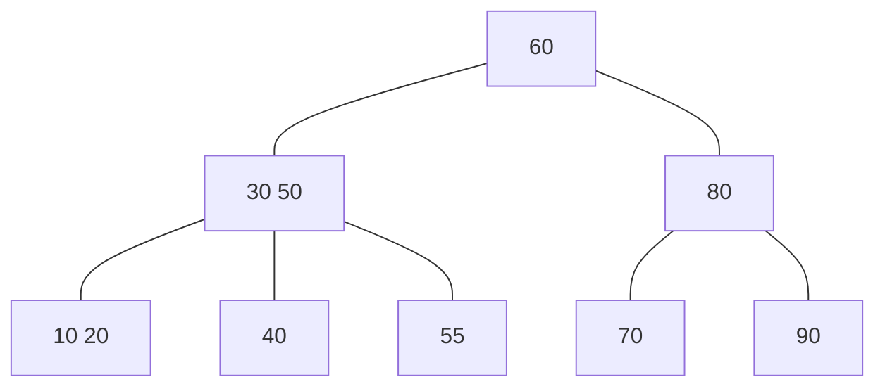

插入操作完成。

### 2. 刪除操作

接下來看 **2-3-4 樹**的刪除操作。

**2-3-4 樹** 可分為四種節點：
1. 葉子節點 + 2-節點
2. 葉子節點 + 非 2-節點
3. 非葉子節點 + 2-節點
4. 非葉子節點 + 非 2-節點

但刪除操作基本上都是在葉子節點完成，因為刪除非葉子節點中的元素，會將問題變成「刪除葉子節點中的替代元素」。

刪除操作：
1. 刪除元素不存在，刪除操作失敗。
2. 刪除元素位於非葉子節點中，不論節點數多少，都會從右子樹複製最小值元素來代替原本位置，並執行「刪除葉子節點中的替代元素」操作。
3. 刪除元素位於葉子節點中，非 2-節點，可以直接刪除，不影響樹的絕對平衡。
4. 刪除元素位於葉子節點中，為 2-節點，刪除元素會破壞樹的絕對平衡，需要進行修正。

修正時，要判斷被刪除的當前位置節點的兄弟節點與父節點。

平衡操作：
- 右兄弟存在且非 2-節點，那麼向左旋轉，否則，左兄弟存在且非 2-節點，那麼向右旋轉，樹又重新平衡。
- 如果它的兄弟節點都是 2-節點，取父節點一個元素與兄弟節點合併：
  - 若父節點非 2-節點，樹又重新平衡。
  - 若父節點是 2-節點，唯一元素被取走，樹依然不平衡，重新執行平衡操作；
  - 若父節點已經是根節點，而且沒有元素了，則釋放它，讓合併後的節點成為新的根節點。

直接來看範例說明。

刪除元素 5：
```mermaid
graph TB;
  A[50] --- B[30] & C[90];
  B[20 40] --- D[5 10] & E[25 30] & F[45];
  C[60 80] --- G[55] & H[70] & I[90];
  
  D:::red;
  classDef red stroke:red,stroke-width:2px;
```
元素 5 不是葉節點中的唯一元素，可以直接刪除。

刪除元素 45：
```mermaid
graph TB;
  A[50] --- B[30] & C[90];
  B[20 40] --- D[10] & E[25 30] & F[45];
  C[60 80] --- G[55] & H[70] & I[90];
  
  F:::red;
  classDef red stroke:red,stroke-width:2px;
```
元素 45 是節點的唯一值，直接刪除會影響絕對平衡，需要修正它。它的左兄弟節點是 3-節點，因此可以執行右旋轉：兄弟元素上移一個元素（30）、父節點元素下移一個元素（40）。

刪除元素 40：
```mermaid
graph TB;
  A[50] --- B[30] & C[90];
  B[20 30] --- D[10] & E[25] & F[40];
  C[60 80] --- G[55] & H[70] & I[90];
  
  F:::red;
  classDef red stroke:red,stroke-width:2px;
```
一樣的情況，元素 40 是節點的唯一值，刪除後需要修正它。但這次兄弟節點也是 2-節點，因此取父節點一個元素（30）與兄弟節點合併。

刪除元素 25：
```mermaid
graph TB;
  A[50] --- B[30] & C[90];
  B[20] --- D[10] & E[25 30];
  C[60 80] --- G[55] & H[70] & I[90];

  E:::red;
  classDef red stroke:red,stroke-width:2px;
```
元素 25 不是葉節點中的唯一元素，可以直接刪除。

刪除元素 10：
```mermaid
graph TB;
  A[50] --- B[30] & C[90];
  B[20] --- D[10] & E[30];
  C[60 80] --- G[55] & H[70] & I[90];

  D:::red;
  classDef red stroke:red,stroke-width:2px;
```
元素 10 是節點的唯一值，父節點與兄弟節點皆為 2-節點，合併後樹還是不平衡：

```mermaid
graph TB;
  A[50] --- B[null] & C[90];
  B[null] --- D[20 30];
  C[60 80] --- G[55] & H[70] & I[90];

  B:::red;
  classDef red stroke:red,stroke-width:2px;
```
將空的父節點作為當前節點，重新執行平衡操作。右兄弟節點是 3-節點，因此可以執行左旋轉，兄弟元素上移一個元素（60）、父節點元素下移一個元素（50），但這裡要注意，因為不是葉子節點，所以子樹也要跟著轉，父節點 50 右子樹繼承 60 的左子樹 55。

刪除元素 90：
```mermaid
graph TB;
  A[60 ] --- B[50] & C[80];
  B[50] --- D[20 30] & E[55];
  C[80] --- H[70] & I[90];
  
  I:::red;
  classDef red stroke:red,stroke-width:2px;
```
元素 90 是節點的唯一值，父節點與兄弟節點皆為 2-節點，合併後樹還是不平衡：

```mermaid
graph TB;
  A[60 ] --- B[50] & C[null];
  B[50] --- D[20 30] & E[55];
  C[null] --- H[70 80];
  
  C:::red;
  classDef red stroke:red,stroke-width:2px;
```

將空的父節點作為當前節點，重新執行平衡操作。父節點與兄弟節點皆為 2-節點，合併後樹還是不平衡：
```mermaid
graph TB;
  Z[null] --- A;
  A[50 60] --- B[20 30] & C[55] & D[70 80];
  
  A:::red;
  classDef red stroke:red,stroke-width:2px;
```
樹的根節點為空，釋放它，讓合併後的節點成為新的根節點。

刪除元素 60：
```mermaid
graph TB;
  A[50 60] --- B[20 30] & C[55] & D[70 80];
  
  A:::red;
  classDef red stroke:red,stroke-width:2px;
```
從右子樹尋找最小值代替，並刪除替代元素 70，元素 70 不是葉節點中的唯一元素，可以直接刪除。

刪除元素 50：
```mermaid
graph TB;
  A[50 70] --- B[20 30] & C[55] & D[80];
  
  A:::red;
  classDef red stroke:red,stroke-width:2px;
```
從右子樹尋找最小值代替，並刪除替代元素 55，元素 55 是葉節點中的唯一元素，直接刪除會影響絕對平衡，需要修正它。

```mermaid
graph TB;
  A[55 70] --- B[20 30] & C[null] & D[80];
  C:::red;
  classDef red stroke:red,stroke-width:2px;
```

它的左兄弟節點是 3-節點，因此可以執行右旋轉：兄弟元素上移一個元素（30）、父節點元素下移一個元素（55）。

```mermaid
graph TB;
  A[30 70] --- B[20] & C[55] & D[80];
```

## 總結

大致上理解 **2-3 樹** 和 **2-3-4 樹** 後，下週將正式來說明黑紅樹的新增、刪除操作。


