這週是六角鼠年鐵人賽第二十四週。

**紅黑樹**和 **<a href="/posts/2007/ds_avl-tree/" target="_blank">AVL-Tree</a>** 一樣是自平衡二元搜尋樹，因為比較難理解、篇幅較長，所以分成三個階段來說明：
1. <a href="/posts/2007/ds_redblack-tree-1" target="_blank">紅黑樹（上）：B 樹、2-3-4 樹</a>
2. <a href="/posts/2007/ds_redblack-tree-2" target="_blank">紅黑樹（中）：新增操作</a>
3. <a href="/posts/2007/ds_redblack-tree-3" target="_blank">紅黑樹（下）：刪除操作</a>

<!--more-->



## 紅黑樹簡介

**紅黑樹（Red–black tree）** 是一種自平衡二元搜尋樹，它是由 Rudolf Bayer 於 1972年發明，當時稱為 **對稱二元 B 樹（Symmetric binary B-trees）**。後來因為 Leo J. Guibas 和 Robert Sedgewick 於 1978年寫的一篇論文改名成現今的名稱。

**紅黑樹**和 AVL-Tree 一樣是自平衡二元搜尋樹，都可以在 $O(\log n)$ 時間內完成尋找、新增和刪除操作。但 **紅黑樹**相對於 AVL-Tree 來說，犧牲了部分平衡性以換取新增、刪除操作時少量的旋轉操作，整體來說效能要優於 AVL-Tree。

### 1. 性質

首先我們來看定義**紅黑樹**規則的五點性質：
1. 任何一個節點非紅即黑；
2. 樹的根節點為黑色；
3. 葉子節點為黑色（NIL）；
4. 每個紅色節點必須有兩個黑色的子節點（不能有兩個連續的紅色節點）；
5. 從任一節點到其每個 NIL 的所有簡單路徑都包含相同數目的黑色節點。


在**紅黑樹**定義中，葉子節點並不是**沒有子節點的節點**，而是指最後的 **空值（NULL）節點**，稱作「NIL」。

但我為了之後方便說明，我們葉子節點，統一指「**沒有子節點的節點**」，空值（NULL）節點，稱作「NIL」。



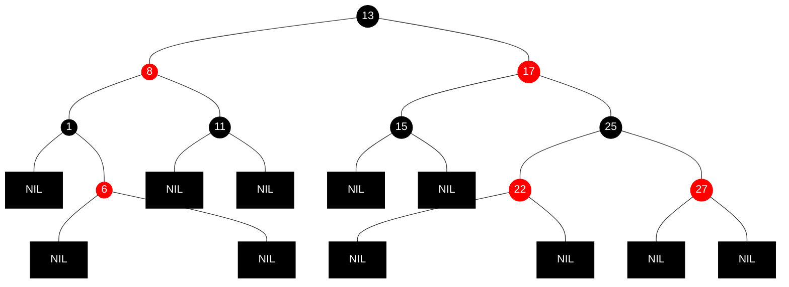

### 2. 說明紅黑樹前

**紅黑樹**如果直接依照性質來說明它的操作，會非常抽象難理解。

因此再說明**紅黑樹**之前，必須先理解什麼是 B 樹、2-3-4 樹，對於理解**紅黑樹**有很大的幫助。因為**紅黑樹**是 **2-3-4 樹**的一種實現方式

## B 樹

**<a href="https://zh.wikipedia.org/wiki/B%E6%A0%91" target="_blank">B 樹（B-tree）</a>** 是一種自平衡的樹，B 是 Balance 平衡的意思，也是由普通的二元搜尋樹變換而來的，但最大的不同就是，它的節點可以擁有 2 個以上的子節點，也就說它已經不是二元樹了。

### 1. 定義

一個 m 階的 **B 樹** 具有以下性質：
1. 每一個節點最多有 m 個子節點；
2. 每一個非葉子節點（根節點除外），最少有 ceil(m / 2) 個子節點；
3. 若根節點非葉子節點時，它至少有 2 個子節點；
4. 有 k 個子節點的非葉子節點擁有，擁有 k − 1 個 **鍵 key**（元素）；
5. 所有的葉子節點都在同一層。

### 2. 絕對平衡

定義第 5 點：所有的葉子節點都在同一層，所以 **B 樹**是一顆絕對平衡的樹。

**絕對平衡**，指的是對於任意一個節點，左右子樹高度相同。也就是說，節點不是沒子節點，就是子節點全滿。

### 3. 插入操作

要插入一個新的元素，一定是在葉子結點中進行，並判斷當前節點的 key 數量是否小於最大值 m - 1：
- 若小於，表示當前節點有空間可以容納新元素，直接插入到這個節點中，並保持節點中的元素有序。
- 若節點已滿，將它拆分成一棵二元樹：
  1. 從該節點的原有元素和新元素選出中位數； 
  2. 小於中位數的元素放入左邊節點，大於中位數的元素放入右邊節點，中位數作為分隔值；
  3. 最後，分隔值會被插入到父節點中，但可能會遇到以下情況：
     - 若沒有父節點，創建一個新的根結點（增加了樹的高度）；
     - 若父節點已滿，需要重複上述操作。

經過以上判斷，插入元素後，**B 樹**依然能保持絕對平衡。

選出中位數可能會遇到插入新元素後，變成奇數的情況，無法整除，作法有很多種：
1. 無條捨去或進位。
2. 或是先選出中位數，才插入新元素。


### 4. 刪除操作

**B 樹**的刪除操作相對於插入操作是相對複雜一些。

共有兩種策略：
1. 定位並刪除元素，然後調整樹使它絕對平衡；
2. 或是，從上到下處理這棵樹，在進入一個節點之前，調整樹使得之後一旦遇到了要刪除的 key，它可以被直接刪除而不需要再進行調整。

簡單來說，就是先刪除後調整，或者是先調整再刪除。

以下使用前者來說明。

**B 樹** 刪除一個元素時有以下兩種特殊情況：
1. 這個元素位於葉子節點中，且是唯一的元素。
2. 這個元素位於內部節點中。

下面分別是這些情況的處理過程。

#### 4.1 刪除葉子節點中的元素

1. 搜尋要刪除的元素；
2. 如果它在葉子節點，將它從中刪除；
3. 若該元素是只唯一的元素，刪除後節點會不見，會導致父節點的子節點數量不符合性質 4，因此需要執行平衡修正。

#### 4.2 刪除內部節點中的元素

內部節點（非葉子節點）中的每一個元素都是作為分隔兩顆子樹的分隔值。因此刪除後，我們可以取一個鄰近元素來作為新的分隔值，並刪除這個用替代的原素。

取得新的分隔值共兩種方法：
1. 從左子樹中，取最大的元素。
2. 或是，從右子樹中，取最小的元素。

這個新的分隔值一定是位於葉子節點中，因此就變成了「刪除葉子節點中的元素」的情況。

#### 4.3 平衡修正

為了避免父節點的子節點數量不符合性質 4，我們會找一個元素來遞補遞補空缺。

將缺少元素節點作為當前節點，判斷它的兄弟節點和父節點是否有多餘的元素：
- 如果兄弟節點存在，且有多餘的元素，那麼：
  1. 將父節點的分隔值下移，遞補被刪除元素的空缺；
  2. 將兄弟節點元素上移，遞補父節點下移分隔值的空缺；
  3. 樹重新平衡。
- 如果左、右弟都只有最小數量的元素，那麼：
  1. 將缺少元素節點與兄弟節點合併；
  2. 並將父節點的分隔值下移至合併後的節點；
  3. 最後檢查父節點：
     - 若父節點依然保持最小數量的元素，樹重新平衡。否則： 
     - 父節點為根節點，且沒有元素，那麼刪除它，讓合併之後的節點成為新的根節點。否則：
     - 不是根節點，將父節點作為當前節點，重新執行平衡修正。

若重新值行平衡修正，兄弟節點已經不是葉子節了，因此會有子樹，若父節點的分隔值下移，會繼承它的子樹（左兄繼承右子樹、右兄既成左子樹）。


#### 5. 實際應用

在實際應用中的 **B 樹** 的階數 m 都非常大，所以即使存儲大量的資料，**B 樹** 的高度依然很小。

舉例來說，若資料量很大時，使用線性搜尋效率相當低，所以基本上會建立**索引（index）** 來取得資料。但資料量變得非常大時，索引大小也會變得很大，搜尋索引的效率也會降低，這時就可以透過 **B 樹**這種資料結構，將索引分成很多份（對應樹的節點），也就是分頁，從而增加效率。

**B 樹** 主要是用外部儲存的一種資料結構，常被應用在資料庫和文件系統的實現上。


## 2-3-4 樹

看完上面一堆說明後，可能會覺得這沙小🤣，我們還是直接來看 **2-3-4 樹** 吧。

**<a href="https://zh.wikipedia.org/wiki/2-3-4树" target="_blank">2-3-4 樹</a>** 就是階為 4 的 **B 樹**。

1. 根據 **B 樹**性質 1，節點最多有 4 個子節點；
2. 根據 **B 樹**性質 2，非葉子節點至少要有 2 個子節點；
3. 根據 **B 樹**性質 1、4，每個節點最多擁有 3 個元素。

### 1. 節點

我們會用節點中存放的元素數量來決定節點的名稱：
- 當存放 1 個元素時，稱作「2-節點」，可擁有 2 個子節點；
- 當存放 2 個元素時，稱作「3-節點」，可擁有 3 個子節點；
- 當存放 3 個元素時，稱作「4-節點」，可擁有 4 個子節點。
- 因為是樹絕對平衡的，所以節點的子節點數量不是零，就是可擁有的最大數量。

這就是為什麼階為 4 的 **B 樹**叫作 **2-3-4 樹**。

### 2. 插入操作

#### 2.1 向空樹插入元素

首先，對一棵空樹，插入一個元素 70，那麼會產生樹的根節點：
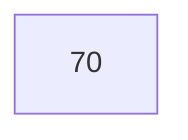

#### 2.2 向有空間的節點插入元素

再插入一個元素 60 時，不會像二元搜尋樹一樣，插入到空節點中。而是「融合」到節點中，變成一個「3-節點」，並保持節點中的元素有序：
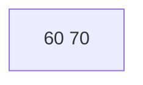

繼續插入一個元素 50，會變成一個「4-節點」：
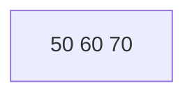

注意，此時節點的空間已滿，已經是最大元素數量。

#### 2.3 向空間已滿的節點插入元素

如果繼續插入一個元素 40，你會發現，4-節點的可存放元素的空間已滿，因此需要「拆分」成一棵二元樹，再插入元素：
1. 將 60 作為分隔值放入父節點中；
2. 左邊節點放小於分隔值的元素；
3. 右邊節點放大於分隔值的元素。

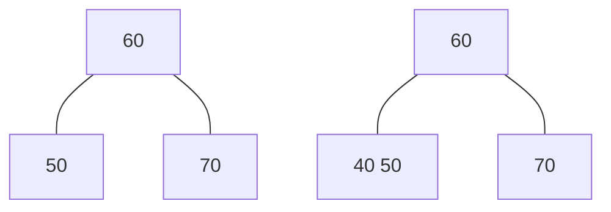

接著要將這棵子樹插入到父節點中，但因為沒有父節點，所以節點 60 會作為新的根節點（樹高加 1）。

#### 2.4 父節點空間也已滿

接下來，我來看一個連續 4-節點的例子。

假如要插入元素 10，會插入紅色框的這個 4-節點中：
```mermaid
graph TB;
  A[50 60 80] --- B[20 30 40] & C[55] & D[70] & E[90 100];
  classDef red, fill:black,stroke:black,color:white;
  classDef red stroke:red;
  B:::red;
```

因此我們需要先將它拆分一棵二元樹：
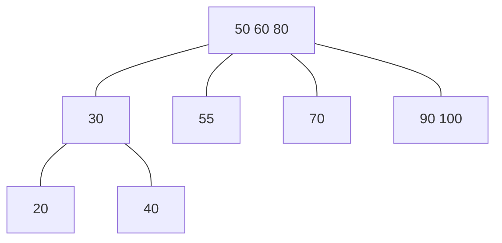

將元素 10 插入到拆分後的子樹中：
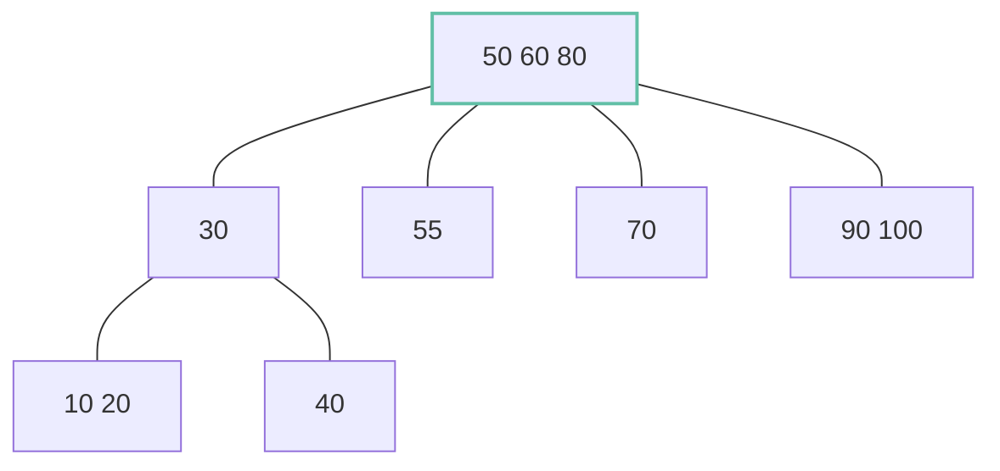
將子樹融合到父節點之前，需要檢查父節點是否也是 4-節點。

如果是，一樣將它拆分：
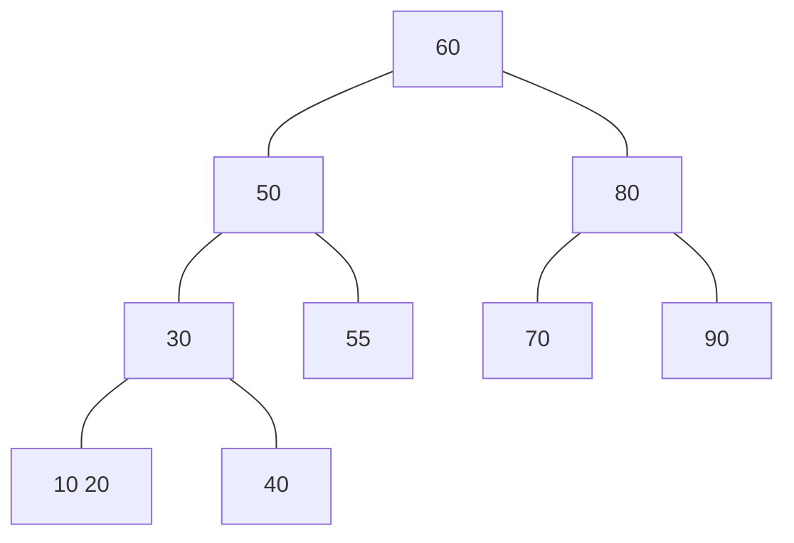
接著就可以將之前的子樹向上融合。

插入完成：
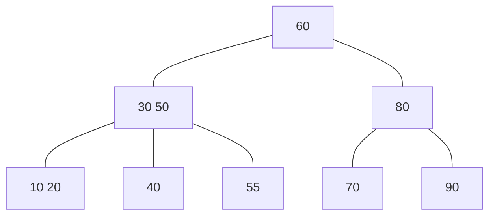

### 3. 刪除操作

接下來看 **2-3-4 樹**的刪除操作，直接來看範例說明。

刪除元素 5：
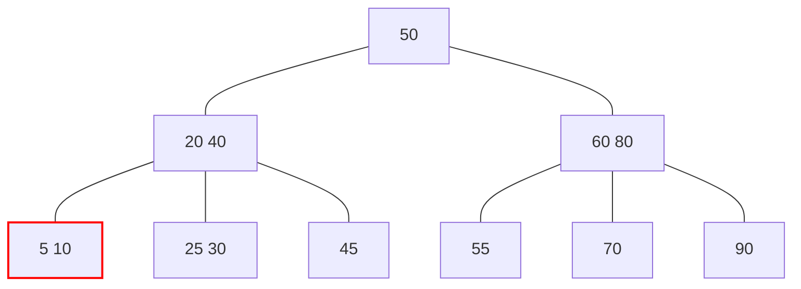
元素 5 不是葉節點中的唯一元素，可以直接刪除。

刪除元素 45：
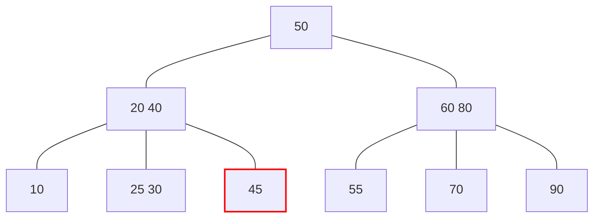
元素 45 是節點的唯一值，刪除後需要修正。兄弟節點有多餘元素：
1. 分隔值 40 下移遞補空缺；
2. 兄弟元素 30 上移，遞補分隔值空缺。

刪除元素 40：
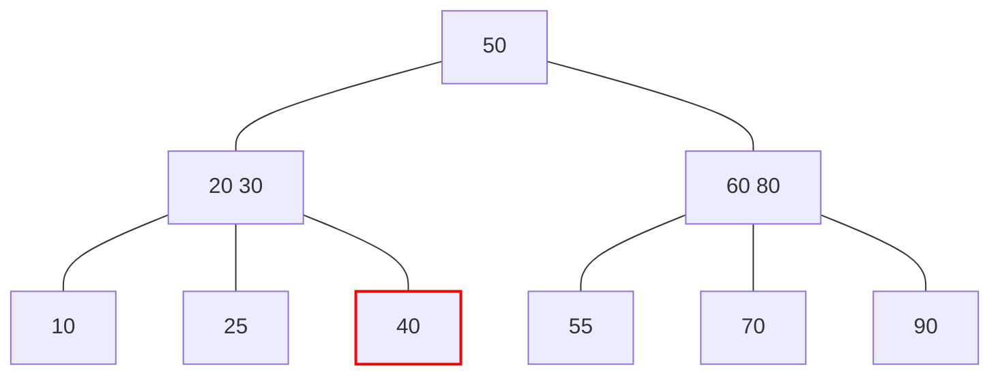
元素 40 是節點的唯一值，刪除後需要修正它。兄弟節點只有最小數量的元素：
1. 將 25 和空節點合併（刪除空節點）；
2. 將分隔值 30 下移至合併後的節點；
3. 父節點依然保持最小數量的元素。

刪除元素 25：
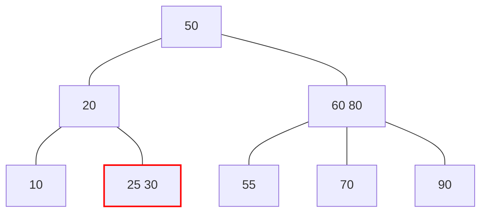
元素 25 不是葉節點中的唯一元素，可以直接刪除。

刪除元素 10：
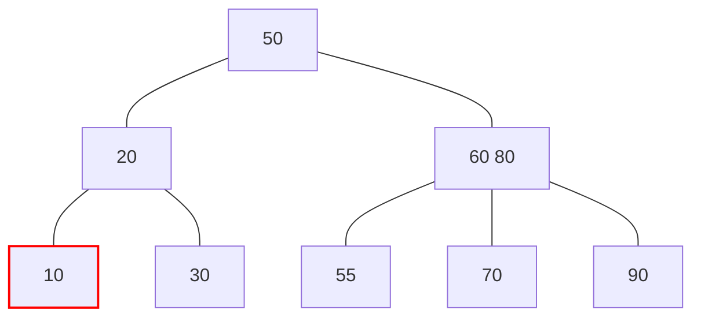
元素 40 是節點的唯一值，刪除後需要修正它。兄弟節點只有最小數量的元素：
1. 將 30 和空節點合併（刪除空節點）；
2. 將分隔值 20 下移至合併後的節點；
3. 父節點無法保持最小數量的元素。

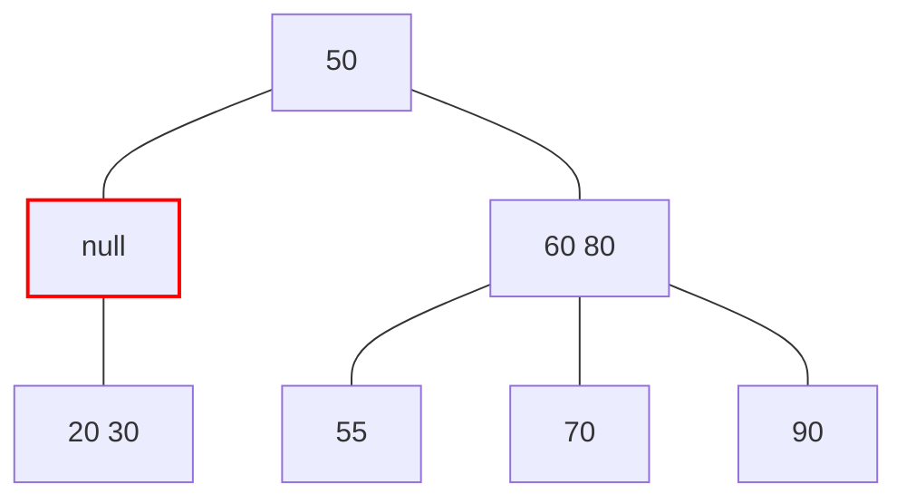
將空的父節點作為當前節點，重新執行平衡修正。兄弟節點有多餘元素：
1. 分隔值 50 下移，並繼承分隔值 60 的左子樹 55；
2. 兄弟元素 60 上移，遞補分隔值空缺。

刪除元素 90：
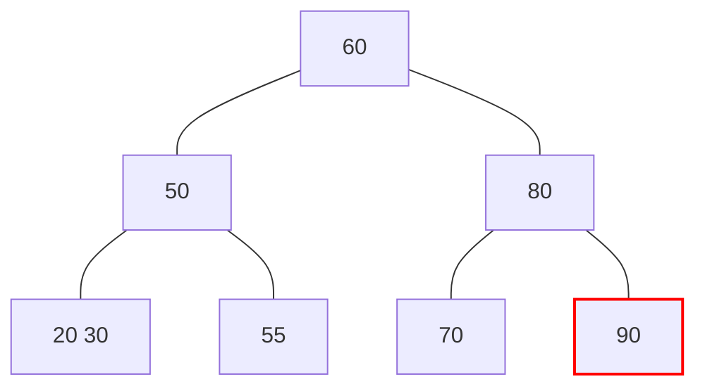
元素 90 是節點的唯一值，刪除後需要修正它。兄弟節點只有最小數量的元素：
1. 將 70 和空節點合併（刪除空節點）；
2. 將分隔值 80 下移至合併後的節點；
3. 父節點無法保持最小數量的元素。

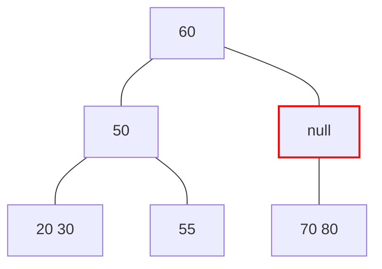
將空的父節點作為當前節點，重新執行平衡修正。兄弟節點只有最小數量的元素：
1. 將 50 和空節點合併（刪除空節點）；
2. 將分隔值 60 下移至合併後的節點；
3. 父節點為根節點，且沒有元素，讓合併之後的節點成為新的根節點。

刪除元素 60：
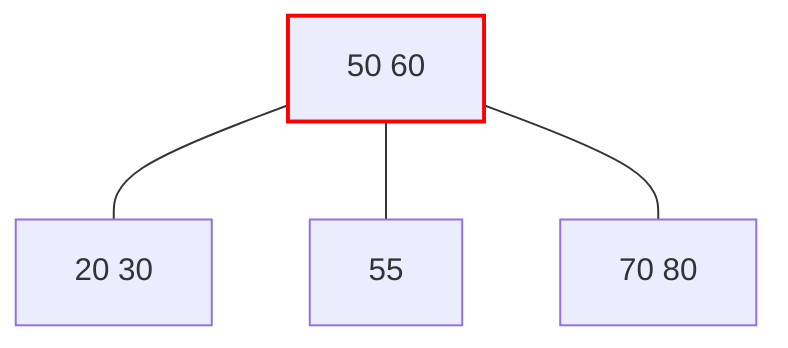

從右子樹尋找最小值替代。接下來需要刪除替代元素 60：
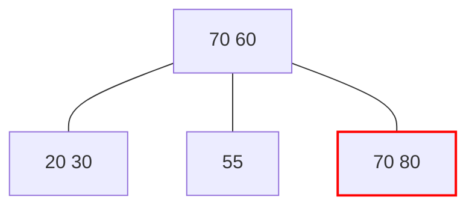
元素 70 不是葉節點中的唯一元素，可以直接刪除。

刪除元素 50：
```mermaid
graph TB;
  A[50 70] --- B[20 30] & C[55] & D[80];
  
  A:::red;
  classDef red stroke:red,stroke-width:2px;
```
從右子樹尋找最小值替代。接下來需要刪除替代元素 55：
```mermaid
graph TB;
  A[55 70] --- B[20 30] & C[null] & D[80];
  
  C:::red;
  classDef red stroke:red,stroke-width:2px;
```
元素 55 是節點的唯一值，刪除後需要修正它。兄弟節點有多餘元素：
1. 分隔值 55 下移；
2. 兄弟元素 30 上移，遞補分隔值空缺。

```mermaid
graph TB;
  A[30 70] --- B[20] & C[55] & D[80];
```

## 總結

對 **B 樹** 和 **2-3-4 樹** 有基本的概念，下週將說明 **紅黑樹** 與 **2-3-4 樹** 的等價關係，還有紅黑樹的新增操作。

