這週是六角鼠年鐵人賽第二十五週。

上週我們簡單說明了**紅黑樹**的基本性質與理解 **B 樹**、**2-3-4 樹**，接下來，我們來看**紅黑樹**和 2-3-4 樹的等價關係與新增操作。
1. <a href="/posts/2007/ds_redblack-tree-1" target="_blank">紅黑樹（上）：B 樹、2-3-4 樹</a>
2. <a href="/posts/2007/ds_redblack-tree-2" target="_blank">紅黑樹（中）：新增操作</a>
3. <a href="/posts/2007/ds_redblack-tree-3" target="_blank">紅黑樹（下）：刪除操作</a>

<!--more-->


## 紅黑樹和 2-3-4 樹的等價關係

**2-3-4 樹**在多數程式語言中實現起來相對困難，因為在樹上的操作涉及大量的特殊情況。而 **紅黑樹** 是基於它的理論基礎所發明的，實現起來更簡單一些。

因此 **紅黑樹**本質上就是 **2-3-4 樹**，所有性質都可以從 **2-3-4樹** 來理解。

### 1. 黑色節點

黑色節點，其實就是 **2-3-4 樹**的 2-節點，為一個中位數。。

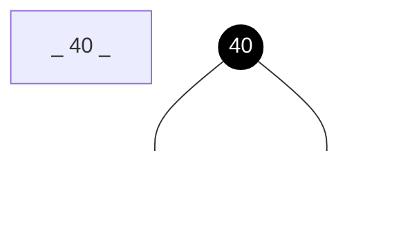

### 2. 紅色節點

黑色節點的子樹如果是紅色節點，表示彼此融合的意思，其實就是 **2-3-4 樹**的 3-節點、4-節點。

3-節點：
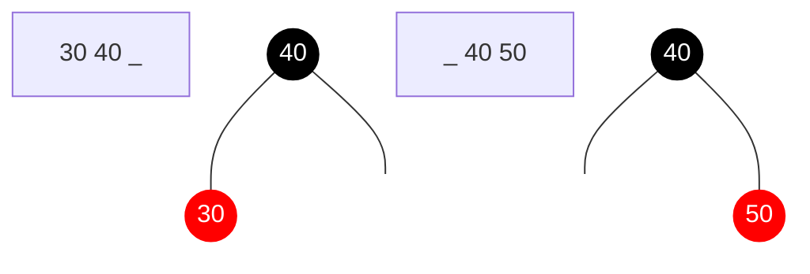

4-節點：
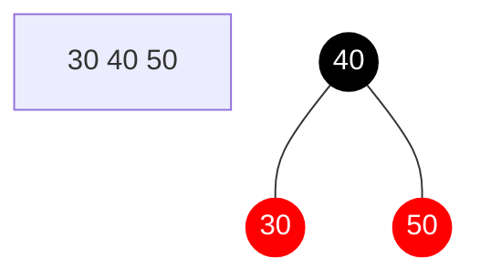

### 3. 2-3 樹

部分資料會說**紅黑樹**等價於 **2-3 樹（3 階 B 樹）**，但正確來說，是「**左傾紅黑樹**」，屬於**紅黑樹**的變種，這裡不討論。

## 紅黑樹的新增操作

**紅黑樹**新增節點後，會檢查樹使否平衡（是否違反**紅黑樹**性質），若不平衡，會透過「旋轉」和「變色」操作來修正。


### 1. 保持根節點是黑色的

在 **2-3-4 樹**插入元素時，都是融合到節點中，因此在**紅黑樹**中，新增的節點一定的紅色的。

首先，我們再一個空樹中新增一個節點：


但**紅黑樹**的性質2：「樹的根節點為黑色」，因此需要將它修正成黑色的：


### 2. 2-節點

一個黑色節點無任何子節點，表示它是一個 2-節點。

那麼當我們新增節點，它會變成一個 3-節點，因此不需要做任何修正：
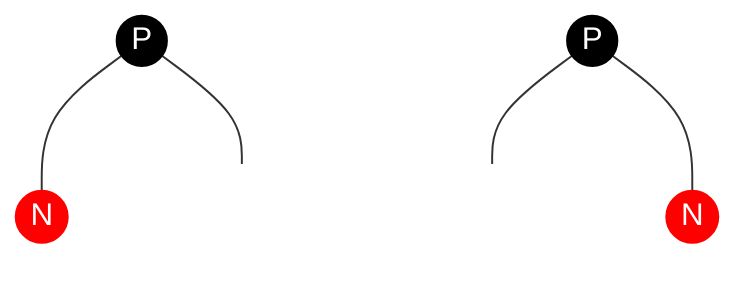

### 3. 3-節點 

當我們對一個 3-節點新增節點，它會變成 4-節點，這時**紅黑樹**可能會違反性質4：「每個紅色節點必須有兩個黑色的子節點（不能有兩個連續的紅色節點）」，因此必須修正它。

舉例來說，**黑紅樹**表示的 3-節在 **2-3-4樹**可能長這樣：
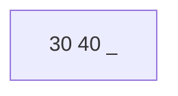
但如果要再插入 20，左邊沒位置。因此要將 30 變成中位數：
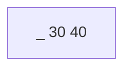
這樣就能插入 20 了：
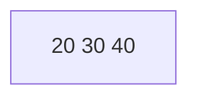

接下來，我們來看需要修正的情況，首先來定義節點代號，方便說明：
- 祖父節點：G
- 父親節點：P
- 新增的節點：N

需要修正情況一：
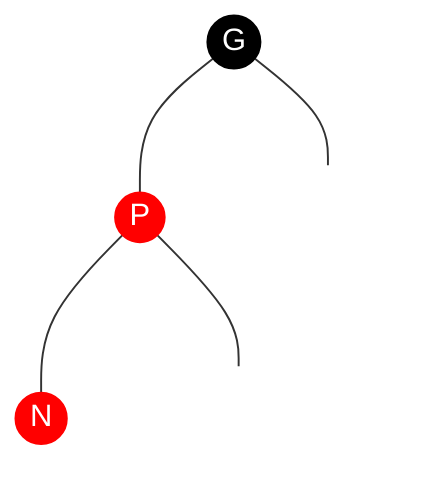

需要對 G 執行右旋轉，並將 G 設為紅色、P 設為黑色：
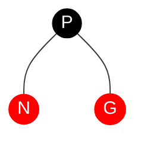

如果你對旋轉操作不熟悉的話，可以先參考我的上一篇文章：**<a href="/posts/2007/ds_avl-tree/" target="_blank">AVL-Tree</a>**。

需要修正情況二：
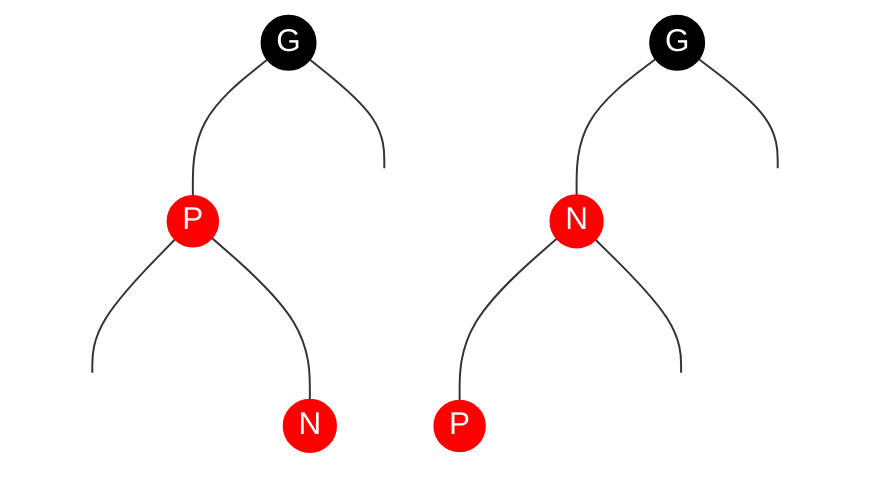

需要先對 P 進行左旋轉，這樣就變成情況一了，再執行相同處理。

情況三、四，基本上就是鏡像情況，先對 P 右旋轉：
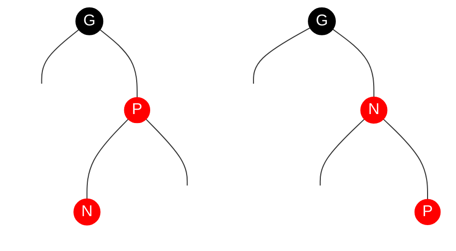

再對 G 左旋轉，並將 G 設為紅色、N 設為黑色：
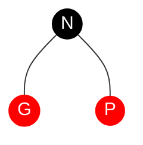

### 4. 4-節點

如果對一個 4-節點新增節點，也就是會形成一個 5-節點，這時紅黑樹一樣會違反性質4。

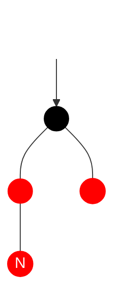

我們會將整棵子樹執行「顏色翻轉 color flip」操作：
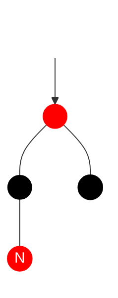
顏色翻轉，其實就是 **2-3-4 樹**中的拆分與向上融合。

當執行完顏色翻轉後，需要重新檢查**黑紅樹**是否違反性質。

## JavaScript 實作紅黑樹新增操作

### 1. 本體

顏色：
```javascript
const NodeColor = {
  RED: true,
  BLACK: false,
};
```
我們使用布林值來定義紅色與黑色。

節點：
```javascript
class RBTNode {
  constructor(data, parent = null) {
    this.data = data;
    this.parent = parent;
    this.left = null;
    this.right = null;
    this.color = NodeColor.RED;
  }
}
```
1. `data`：儲存資料
2. `parent`：父節點
3. `left`：左子節點
4. `right`：右子節點
5. `color`：節點顏色（新增節點一定是紅色的，所以預設紅色）

**紅黑樹**的節點比普通的二元搜尋樹多了顏色和紀錄父節點屬性，也就是說，它是一個雙向鏈結。

根：
```javascript
class RedBlackTree {
  constructor() {
    this.root = null;
  }
  // methods
}
```

### 2. 旋轉操作

**紅黑樹**因為多了顏色和父節點，因此旋轉操作還需要更新顏色、父節點。

#### 2.1 右旋轉
```javascript
rightRotation(node) {
  const temp = node.left;
  node.left = temp.right;
  temp.right = node;

  // 更新顏色
  temp.color = node.color;
  node.color = NodeColor.RED;

  // 更新父節點
  this.replaceParent(node, temp);
  temp.parent = node.parent;
  node.parent = temp;
  if (node.left) {
    node.left.parent = node;
  }
}
```

#### 2.2 左旋轉
```javascript
leftRotation(node) {
  const temp = node.right;
  node.right = temp.left;
  temp.left = node;

  temp.color = node.color;
  node.color = NodeColor.RED;

  this.replaceParent(node, temp);
  temp.parent = node.parent;
  node.parent = temp;
  if (node.right) {
    node.right.parent = node;
  }
}
```

#### 2.3 輔助方法

替換父節點的指向：
```javascript
replaceParent(curNode, newNode) {
  const { parent } = curNode;
  if (!parent) {
    this.root = newNode;
  } else if (curNode === parent.left) {
    parent.left = newNode;
  } else {
    parent.right = newNode;
  }
}
```
1. 如果父節點不存在，更新樹的根節點；
2. 如果是左子樹，更新左子樹；
3. 若不是，則更新右子樹。

### 3. 新增操作

基本上與普通二元搜尋樹相同，只是多了父節點的指向與檢查是否平衡。

歸迴版本：
```javascript
insert(data) {
  const insertHelper = (node) => {
    const curNode = node;
    if (data < curNode.data) {
      if (curNode.left) {
        insertHelper(curNode.left);
      } else {
        curNode.left = new RBTNode(data);
        curNode.left.parent = curNode;
        this.insertFixRBT(curNode.left);
      }
    } else if (data > curNode.data) {
      if (curNode.right) {
        insertHelper(curNode.right);
      } else {
        curNode.right = new RBTNode(data);
        curNode.right.parent = curNode;
        this.insertFixRBT(curNode.right);
      }
    }
  };
  if (!this.root) {
    this.root = new RBTNode(data);
    this.insertFixRBT(this.root);
  } else {
    insertHelper(this.root);
  }
}
```

迭代版本：
```javascript
insert(data) {
  if (!this.root) {
    this.root = new RBTNode(data);
    this.insertFixup(this.root);
    return this.root;
  }

  let curNode = this.root;

  while (curNode) {
    if (data < curNode.data) {
      if (curNode.left) {
        curNode = curNode.left;
      } else {
        curNode.left = new RBTNode(data, curNode);
        this.insertFixup(curNode.left);
        break;
      }
    } else if (data > curNode.data) {
      if (curNode.right) {
        curNode = curNode.right;
      } else {
        curNode.right = new Node(data, curNode);
        this.insertFixup(curNode.right);
        break;
      }
    }
  }

  return this.root;
}
```


### 4. 新增操作平衡修正

新增節點後，檢查紅黑樹是否符合特性，並修正它。

節點代號，方便說明：
- 當前節點：N
- 父親節點：P
- 祖父節點：G
- 叔叔節點：U

檢查是否需要修正，修正條件「P 是紅色且 G 存在」：
- 若 P 為 G 的左子節點：
  - 判斷 U 是否為紅色節點，若是，則執行顏色翻轉。
  - 若不存在，判斷 N 是否為 P 的右子節點：
    - 如果是右子節點，先對 P 執行左旋轉；
  - 對 G 執行右旋轉。
- 若 P 為 G 的右子節點：
  - 判斷 U 是否為紅色節點，若是，則執行顏色翻轉。
  - 若不存在，判斷 N 是否為 P 的左子節點：
    - 如果是左子節點，先對 P 執行右旋轉；
  - 對 G 執行左旋轉。
- 以上修正結束，將目前節點設為祖父節點，再次檢查是否需要修正。

修正結束後，記得將根結點設為黑色。

```javascript
insertFixup(node) {
  let curNode = node;
  while (this.isRed(curNode.parent) && curNode.parent.parent) {
    const { parent } = curNode;
    const grandparent = parent.parent;

    if (parent === grandparent.left) {
      if (this.isRed(grandparent.right)) {
        this.flipColor(grandparent);
      } else {
        if (curNode === parent.right) {
          this.leftRotation(parent);
        }
        this.rightRotation(grandparent);
      }
    } else {
      if (this.isRed(grandparent.left)) {
        this.flipColor(grandparent);
        curNode = grandparent;
      } else {
        if (curNode === parent.left) {
          this.rightRotation(parent);
        }
        this.leftRotation(grandparent);
      }
    }
    curNode = grandparent;
  }
  this.root.color = NodeColor.BLACK;
}
```

### 4.1 輔助方法

判斷節點顏色：
```javascript
isRed(node) {
  return node ? node.color : false;
}
```

顏色翻轉：
```javascript
flipColor(node) {
  node.color = NodeColor.RED;
  node.left.color = NodeColor.BLACK;
  node.right.color = NodeColor.BLACK;
}
```

## 總結

這是我用 Vue.js 製作的，可以很的方便觀察黑紅樹的結構變化：

<iframe height="800" style="width: 100%;" scrolling="no" title="Red - Black Tree - insert  with Vue.js" src="https://codepen.io/chupai/embed/NWxbRdY?height=265&theme-id=dark&default-tab=result" frameborder="no" allowtransparency="true" allowfullscreen="true">
  See the Pen <a href='https://codepen.io/chupai/pen/NWxbRdY'>Red - Black Tree - insert  with Vue.js</a> by Chupai@Design
  (<a href='https://codepen.io/chupai'>@chupai</a>) on <a href='https://codepen.io'>CodePen</a>.
</iframe>

下週來說明更麻煩的刪除操作。
