這週是六角鼠年鐵人賽第二十六週。

最後我們來看紅黑樹刪除操作，相較於新增操作複雜。

1. <a href="/posts/2007/ds_redblack-tree-1" target="_blank">紅黑樹（上）：B 樹、2-3-4 樹</a>
2. <a href="/posts/2007/ds_redblack-tree-2" target="_blank">紅黑樹（中）：新增操作</a>
3. <a href="/posts/2007/ds_redblack-tree-3" target="_blank">紅黑樹（下）：刪除操作</a>


<!--more-->


## 紅黑樹的刪除操作

在 **紅黑樹** 中，刪除一個節點，跟普通二元搜尋樹一樣有以下三種情況：
1. 葉子節點（無子樹）。
2. 節點有單邊子樹。
3. 節點有左右兩邊子樹。

情況 3，的處理方式與普通二元搜尋樹相同，會從右子樹尋找最小值代替，將問題變成刪除替代節點（不是情況 1、就是情況 2）。

但**紅黑樹**有兩種顏色的節點，因此還需要考慮節點顏色的不同，不過刪除操作後，需要平衡修正的，基本上只有刪除黑色的葉子節點。


注意，這裡指的葉子節點是沒有子節點的節點，而不是**紅黑樹**定義的 NIL。


### 1. 節點有單邊子樹

因為有兩種顏色，所以節點有單邊子樹組合可能有 4 種，但實際存在的只有 1 種：
- 紅紅：不符合性質 4，不存在；
- 紅黑：不符合性質 4，不存在；
- 黑黑：不符合性質 5，不存在；
- 黑紅：存在。

性質 4、5：
- 性質 4：每個紅色節點必須有兩個黑色的子節點（不能有兩個連續的紅色節點）；
- 性質 5：從任一節點到其每個 NIL 的所有簡單路徑都包含相同數目的黑色節點。

黑紅組合，直接刪除黑色節點後，會由紅色節點遞補，不影響平衡。
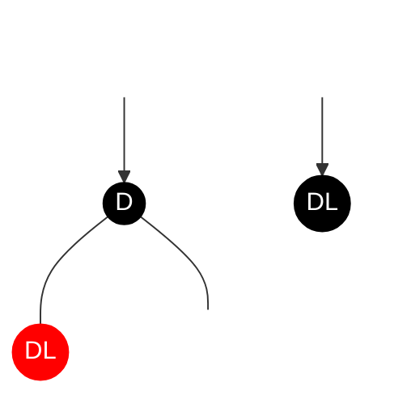
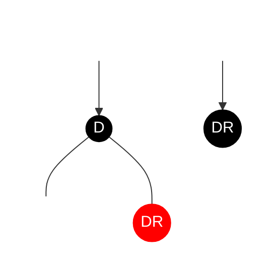

### 2. 刪除紅色葉子節點

刪除紅色葉子節點，也不會影響**紅黑樹**的特性，因此直接刪除即可，不需要修正。
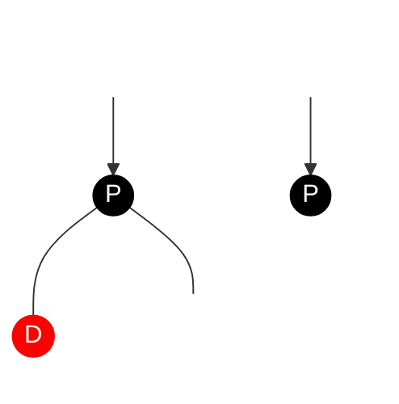
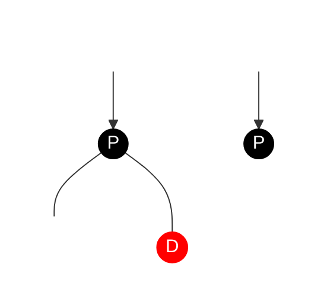
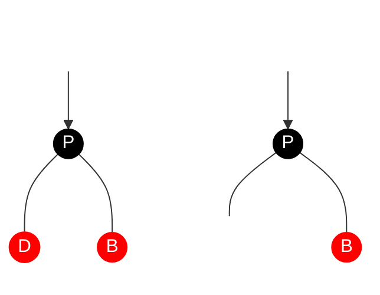
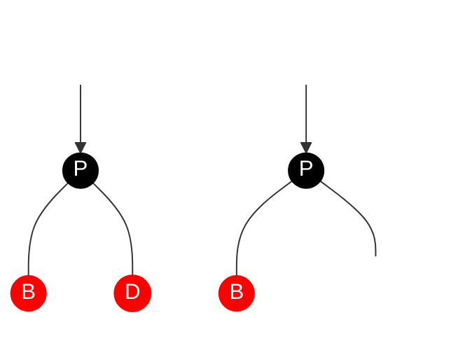

### 3. 刪除黑色葉子節點

遇到此情況最麻煩，因為可能會破壞**紅黑樹**性質 4，因此必須修正它。

不需要修正的情況：
- 如果黑色葉子節點是根節點，直接刪除即可，不用修正。


修正的方法其實就是重新調整左、右子樹的黑色節點數量，讓他們保持相同，不違反性質 4，因此要判斷兄弟節點的狀態。

需要修正的情況組合：
1. 黑兄無侄紅父
2. 紅兄（黑侄黑父）
4. 黑兄紅侄
5. 黑兄黑父

### 3.1 黑兄黑姪紅父

- 兄弟節點 B：黑色
- 姪子節點（兄弟子節點）：無
- 父節點 P：紅色

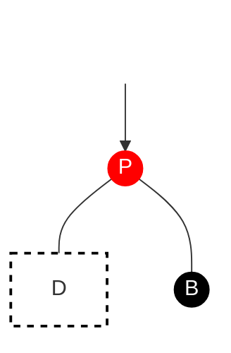

修正處理：P 設為黑色、B 設為紅色。
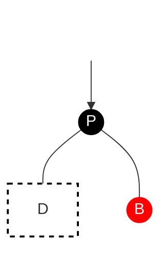

用 **2-3-4** 樹表示：
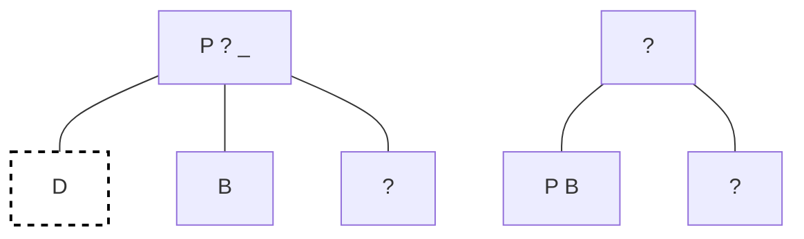

如果是鏡像情況，相同的修正處理方式。

### 3.2 紅兄（黑侄黑父）

- 兄弟節點 B：紅色
- 姪子節點（兄弟子節點）Ｌ、Ｒ：一定有姪子節點，且為黑色
- 父節點 P：一定是黑色

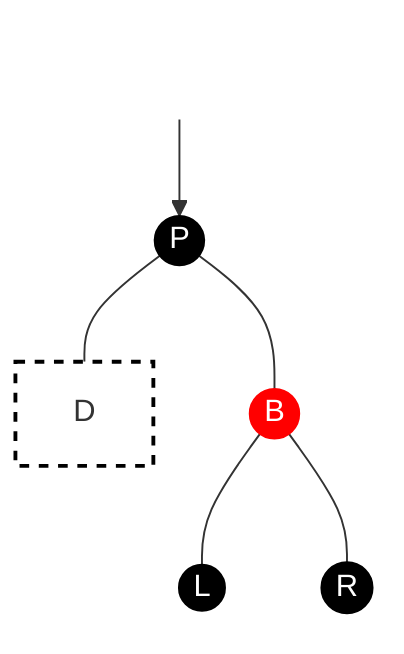

修正處理：對 P 進行左旋轉，並將 P 設為紅色，B 設為黑色。
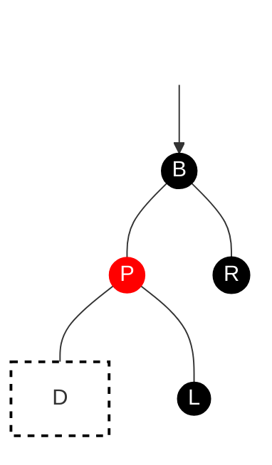

子樹 P 就變成情況一，執行相同修正處理：
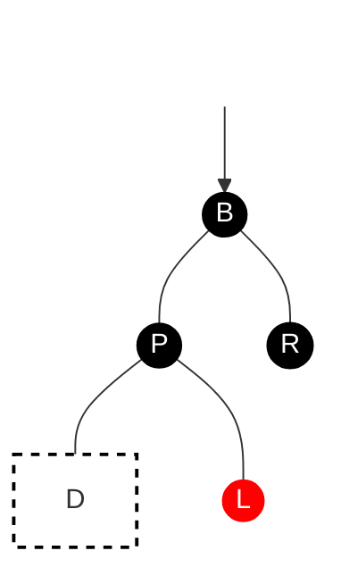

用 **2-3-4** 樹表示：
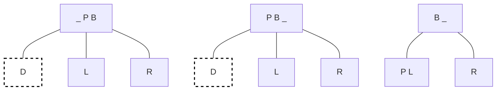

如果是鏡像情況，改對 P 進行右旋轉。

#### 3.3 黑兄紅侄

- 兄弟節點 B：黑色
- 父節點 P：黑色或紅色
- 姪子節點（兄弟子節點）Ｌ、Ｒ：紅色，共三種狀態：
  - L、R 都存在
  - 只有 R
  - 只有 L

基本狀態，L、R 都存在：
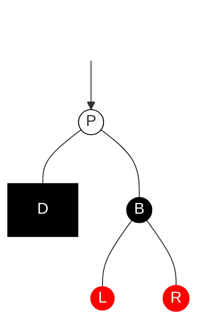

修正處理：對 P 執行左旋轉，並將 P 設為黑色、B 設為 P 的顏色、R 設為黑色。
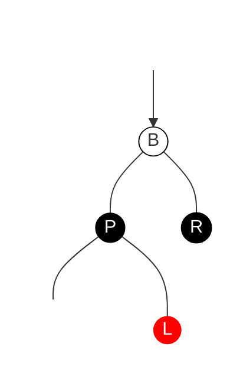

若只有 R、沒有 L，可執行相同修正處理：
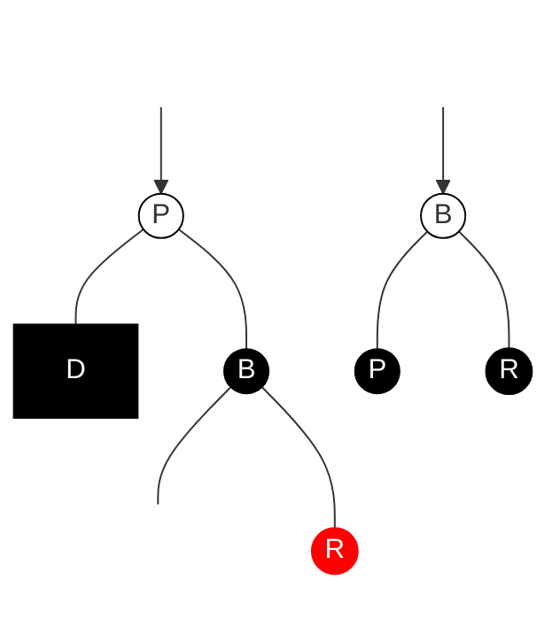

若只有 L，沒有 R，需先對 B 執行右旋轉，並將 L 設為黑色、B設為紅色，就會變上面的情況，再執行上面的修正處理：
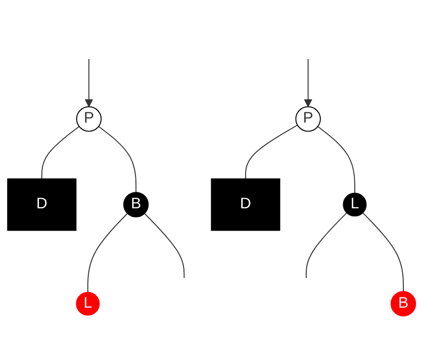

用 **2-3-4** 樹表示：
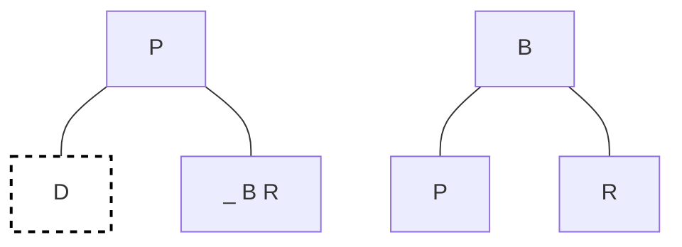

如果是鏡像情況，左旋轉改右旋轉、右旋轉改左旋轉，修正邏輯相同。

### 3.4 黑兄黑父

- 兄弟節點 B：黑色
- 父節點 P：紅色
- 姪子節點（兄弟子節點）：無或是黑色節點

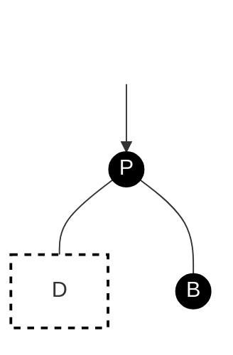

首先，B 設為紅色：


樹依然是不平衡，因此將 P 設為當前節點，再次執行平衡操作。

用 **2-3-4** 樹表示：
```mermaid
graph TB;
  N --> A;
  A[P] --- B[D] & C[B];
  
  N1 --> A1;
  A1[null] --- B1[P B];
  
  class N,N1 transparent;
  class B,B2 del;
  classDef del fill:#fff,stroke:black,stroke-width:2px,color:#black,stroke-dasharray: 5;
  classDef transparent fill:transparent,stroke:transparent,color:transparent;
  classDef del fill:#fff,stroke:black,stroke-width:2px,color:#black,stroke-dasharray: 5;
```

## JavaScript 實作紅黑樹刪除操作

### 1. 刪除操作

因為**紅黑樹**的節點是雙向的，我們可以直接用尋找方法取得節點，並更改父節點的指向。

```javascript
remove(data, node = this.root) {
  const delNode = this.search(data, node);
  if (!delNode) {
    return false;
  }
  // 葉子節點
  if (!delNode.left && !delNode.right) {
    // 紅色
    if (this.isRed(delNode)) {
      this.replaceParent(delNode, null);
      // 黑色
    } else {
      this.deleteFixup(delNode);
      this.replaceParent(delNode, null);
    }
    // 單邊子樹
  } else if (!delNode.left || !delNode.right) {
    // 單邊左子樹
    if (delNode.left) {
      delNode.left.color = NodeColor.BLACK;
      delNode.left.parent = delNode.parent;
      this.replaceParent(delNode, delNode.left);
      // 單邊右子樹
    } else {
      delNode.right.color = NodeColor.BLACK;
      delNode.right.parent = delNode.parent;
      this.replaceParent(delNode, delNode.right);
    }
  } else {
    const aux = this.findMin(delNode.right);
    delNode.data = aux.data;
    this.remove(aux.data, delNode.right);
  }
  return this.root;
}
```
我們說明時，是刪除後修正，但實作時，先刪除就沒辦法傳入節點判斷了，因此這裡改成先判斷刪除後是否會影響平衡，若會影響平衡先調整在刪除。


#### 1.1 輔助方法

尋找節點、尋找最小值，在一般的二元搜尋樹都有說明過：
```javascript
search(data, node = this.root) {
  if (!node) {
    return false;
  }
  if (data === node.data) {
    return node;
  }
  if (data < node.data) {
    return this.search(data, node.left);
  }
  return this.search(data, node.right);
}

findMin(node = this.root) {
  let currentNode = node;
  while (currentNode && currentNode.left) {
    currentNode = currentNode.left;
  }
  return currentNode;
}
```

替換父節點的指向，在新增節點操作說明過：
```javascript
replaceParent(curNode, newNode) {
  const parent = curNode.parent;
  if (!parent) {
    this.root = newNode;
  } else if (parent.left === curNode) {
    parent.left = newNode;
  } else {
    parent.right = newNode;
  }
}
```

### 2. 刪除操作平衡修正

節點代號，方便說明：
- 當前節點：N
- 父親節點：P
- 祖父節點：G
- 兄弟節點：B
- 姪子節點：L、R

檢查是否需要修正，修正條件「非根節點且為黑色」：
- 若 N 為 P 的左子節點，B 為 P 的右子節點：
  1. 若 B 是紅色，對 P 左旋轉，重新執行修正檢查。否則：
  2. 若 L 和 R 皆為黑色（包含 NIL）：
     - 若 P 是紅色，將 P 設為黑色、右子節點設為紅色，結束修正。否則：
     - 將 B 設為紅色，並將 N 設為 P，重新執行修正檢查。
  3. 若 L 是紅色且 R 不存在，對 B 執行右旋轉，並重新執行執行操作。否則：
  4. 對 P 轉左旋轉，並將 P、R 設為黑色，結束修正。
- 若 N 為 P 的右子節點，B 為 P 的左子節點：
  1. 若 B 是紅色，對 P 左旋轉，重新執行修正檢查。否則：
  2. 若 L 和 R 皆為黑色（包含 NIL）：
     - 若 P 是紅色，將 P 設為黑色、左子節點設為紅色，結束修正。否則：
     - 將 B 設為紅色，並將 N 設為 P，重新執行修正檢查。
  3. 若 L 是紅色且 R 不存在，對 B 執行左旋轉，並重新執行執行操作。否則：
  4. 對 P 轉右旋轉，並將 P、L 設為黑色，結束修正。


```javascript
deleteFixup(node) {
  let currNode = node;
  while (currNode !== this.root && !this.isRed(currNode)) {
    const { parent } = currNode;
    let bother;

    if (currNode === parent.left) {
      bother = parent.right;
      if (this.isRed(bother)) {
        this.leftRotation(parent);
      }
      if (!this.isRed(bother.left) && !this.isRed(bother.right)) {
        if (this.isRed(parent)) {
          parent.color = NodeColor.BLACK;
          parent.right.color = NodeColor.RED;
          break;
        }
        bother.color = NodeColor.RED;
        currNode = parent;
      } else if (this.isRed(bother.left) && !this.isRed(bother.right)) {
        this.rightRotation(bother);
      } else {
        this.leftRotation(parent);
        parent.color = NodeColor.BLACK;
        bother.right.color = NodeColor.BLACK;
        break;
      }
    } else {
      bother = parent.left;
      if (this.isRed(bother)) {
        this.rightRotation(parent);
      }
      if (!this.isRed(bother.left) && !this.isRed(bother.right)) {
        if (this.isRed(parent)) {
          parent.color = NodeColor.BLACK;
          parent.left.color = NodeColor.RED;
          break;
        }
        bother.color = NodeColor.RED;
        currNode = parent;
      } else if (this.isRed(bother.right) && !this.isRed(bother.left)) {
        this.leftRotation(bother);
      } else {
        this.rightRotation(parent);
        parent.color = NodeColor.BLACK;
        bother.left.color = NodeColor.BLACK;
        break;
      }
    }
  }
}
```

## 紅黑樹總結

### 1. 紅黑樹和 AVL-Tree 比較

**紅黑樹**和 AVL-Tree 一樣是自平衡二元搜尋樹，都可以在 $O(\log n)$ 時間內完成尋找、新增和刪除操作。

AVL-Tree，屬於嚴格平衡樹，透過計算 BF，讓任意子節點的左右子樹高度相差不超過 1。

而**紅黑樹**，透過增加節點顏色，來維持定義的特性，相對於 AVL-Tree 來說，犧牲了部分平衡性（多一層），換取平衡修正操作時的少量旋轉操作，整體來說效能要優於 AVL-Tree。

- 對於新增操作，AVL-Tree 和 **紅黑樹** 最多只需要執行 2 次旋轉操作，即平衡修正為 $O(1)$ 的時間複雜度
- 但刪除操作，AVL-Tree 需要維護被刪節點到根節點路徑上所有節點的平衡性，因此平衡修正時間複雜度需要 $O(\log n)$。而**紅黑樹**的刪除操作，最多只需要三次旋轉，即平衡修正為 $O(1)$ 的時間複雜度。
- 查詢操作則是 **紅黑樹** 略遜於 AVL-Tree，因為它會比 AVL-Tree 多一層。

### 2. 視覺化

這是我用 Vue.js 製作的，可以很的方便觀察黑紅樹的結構變化：
<iframe height="800" style="width: 100%;" scrolling="no" title="Red - Black Tree   with Vue.js" src="https://codepen.io/chupai/embed/qBbrewW?height=265&theme-id=dark&default-tab=result" frameborder="no" allowtransparency="true" allowfullscreen="true">
  See the Pen <a href='https://codepen.io/chupai/pen/qBbrewW'>Red - Black Tree   with Vue.js</a> by Chupai@Design
  (<a href='https://codepen.io/chupai'>@chupai</a>) on <a href='https://codepen.io'>CodePen</a>.
</iframe>