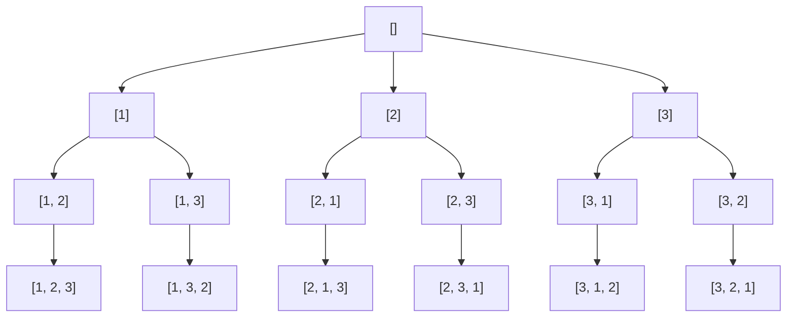

這週是六角鼠年鐵人賽第三十五週。

<!--more-->



## 何謂回溯法

[回溯法（Backtracking）](https://zh.wikipedia.org/wiki/回溯法)是暴力搜尋法（窮舉搜尋、枚舉法）中的一種。用試錯的思想，在分步解決問題的過程中，當探索到某一步時，發現原先選擇並不能得到有效的正確的解答的時候，就退回一步甚至是上幾步的計算重新選擇。

可以分為兩個概念：
1. 枚舉 enumerate：每一步列出所有可能的下一步一一測試。
2. 剪枝 pruning：遇到不符合條件的下一步便省略，不再繼續枚舉。

## 全排列

用 **全排列（Permutations）** 來理解回溯法。

問題：用程式列出所有由 1、2、3 構成的 **不重複序列**。

首先使用巢狀迴圈枚舉所有可能：
```javascript
const res = [];

for (let i = 1; i <= 3; i +=1) {
  for (let j = 1; j <= 3; j +=1) {
    for (let k = 1; k <= 3; k +=1) {
      res.push([i, j , k]);
    }
  }
}
```
共會有 27 種組合，包含了不符合條件的。

檢查約束條件（不重複），過濾重複的組合：
```javascript
const res = [];

for (let i = 1; i <= 3; i += 1) {
  for (let j = 1; j <= 3; j += 1) {
    for (let k = 1; k <= 3; k += 1) {
      if (i === j || i === k || j === k) {continue;}
      res.push([i, j, k]);
    }
  }
}

console.log(res);
// [ [ 1, 2, 3 ], 
//   [ 1, 3, 2 ], 
//   [ 2, 1, 3 ], 
//   [ 2, 3, 1 ], 
//   [ 3, 1, 2 ], 
//   [ 3, 2, 1 ] ] 
```
求得六組解。

但是我們如果最後一層才做檢查，會有多餘的檢查，因為當 `i === j` 時，不論 `k` 是什麼，都不可能會是我們要的。

因此我們可以提早檢查，提早結束：
```javascript
const res = [];

for (let i = 1; i <= 3; i +=1) {
  for (let j = 1; j <= 3; j +=1) {
    if (i === ｊ) {continue;}
    for (let k = 1; k <= 3; k +=1) {
      if (i === k || ｉ === k) {continue;}
      res.push([i, j, k]);
    }
  }
}
```

不過使用巢狀迴圈會有一個問題，你無法調整深度，假設數字增加，就會造成迴圈有非常多層，另一種情況是你根本不知道會有幾層。

所以通常回溯法會使用**遞迴方法來實作**，在反覆重複上述的步驟後可能出現兩種情況：
- 找到一個可能存在的正確的答案；
- 在嘗試了所有可能的分步方法後宣告該問題沒有答案。

遞迴可以再改寫成迭代的方式（堆疊/佇列 + 迴圈）。

將問題用樹狀結構表示：

因為有約束條件（不重複），在這棵樹上我們有做**剪枝**，剪去一些不會產生正確解的選擇（分支）。

求解過程其實就是深度優先搜尋。


從 `[]` 出發：
- 首先選擇 `1`，`path = [1]`；
- 因為有約束條件，所以跳過 `1` 選擇 `2`，`path =[1, 2]`；
- 繼續往下層，因為有約束條件，所以跳過 `1, 2` 選擇 `3`，`path = [1, 2, 3]` 求得解所以回到 `[1, 2]`；
- 沒 `nums` 可選了，所以繼續退回上層 `[1]`；
- 接下來就是重複相同操作。

```javascript
function permute(nums) {
  const res = [];
  const used = {}; // 判斷數字是否使用過
  dfs([]);
  
  // path 當前路徑
  function dfs(path) {
    if (path.length === nums.length) {
      res.push([...path]); // 傳拷貝
      return;  // 回上層
    }
    for (const num of nums) {
      if (used[num]) {}; // 約束條件
      path.push(num);
      used[num] = true;
      dfs(path);  // 繼續下層
      path.pop(); // 恢復路徑
      used[num] = false;
    }
  }
  return res;
}

console.log(permute([1, 2, 3]));
// [ [ 1, 2, 3 ], 
//   [ 1, 3, 2 ], 
//   [ 2, 1, 3 ], 
//   [ 2, 3, 1 ], 
//   [ 3, 1, 2 ], 
//   [ 3, 2, 1 ] ] 
```

可以輸入其他不重複的數列，求其全排列。
